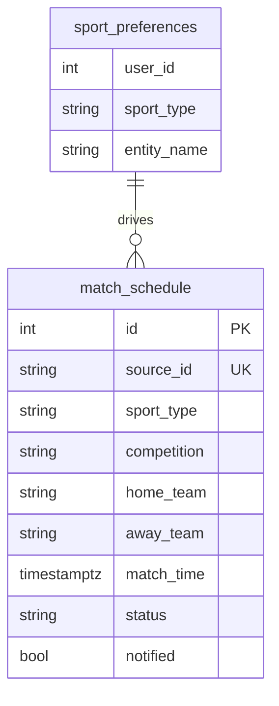
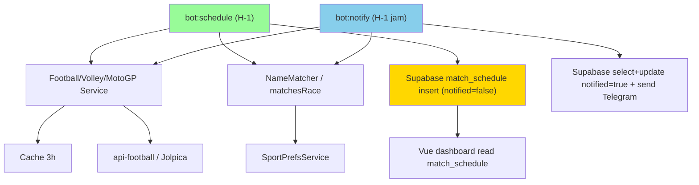
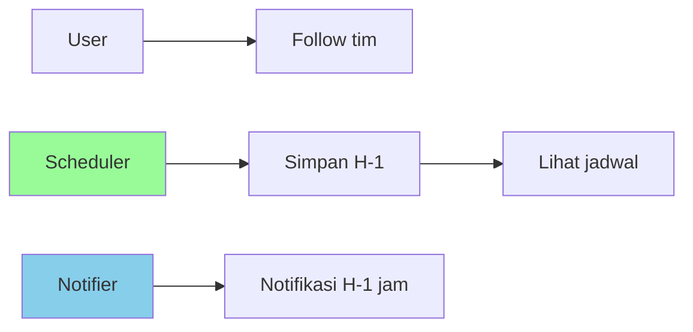
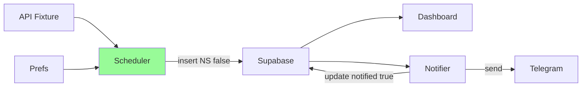
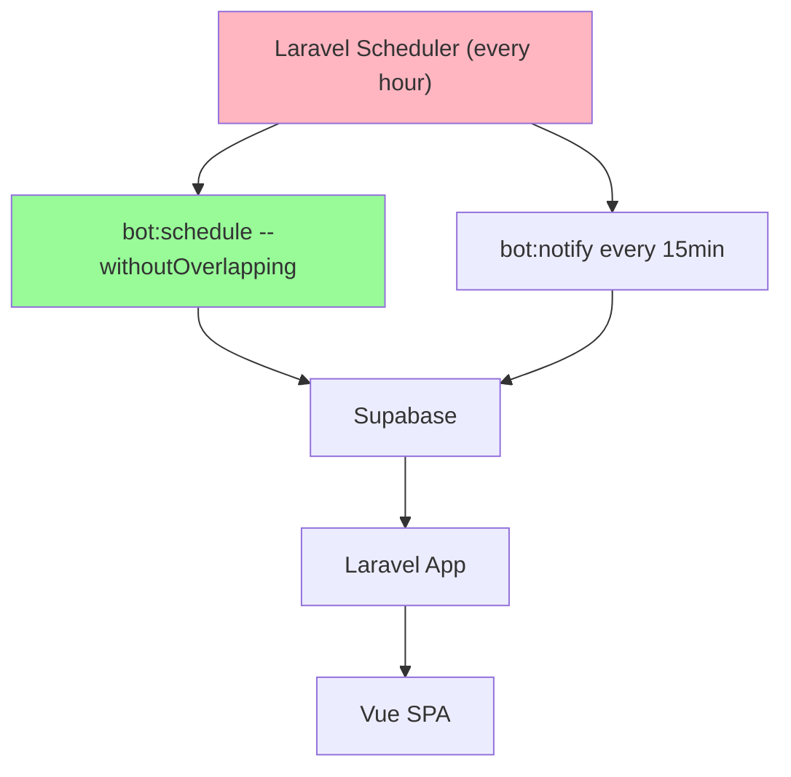

# Implementation Plan: Simpan Jadwal H-1 Pertandingan Mendatang

**Branch**: `001-jadwal-h-1` | **Date**: 2026-08-27 | **Spec**: `specs/001-jadwal-h-1/spec.md`

## Summary

Tambah penjadwalan untuk simpan jadwal mendatang H-1 (24-30 jam sebelum kickoff) ke `match_schedule` dengan `notified=false`. Reuse `MatchNotifier` logic match & deduplicate, tapi pisah jendela waktu: H-1 simpan, H-1 jam notif. Tanpa UI baru.

## Technical Context

**Language/Version**: PHP 8.3, Laravel 13  
**Primary Dependencies**: SupabaseService, FootballService, VolleyballService, MotoGPService, NameMatcher, TelegramService, SportPrefsService  
**Storage**: Supabase Postgres `match_schedule` (HTTP API) + Cache (football.upcoming 3h)  
**Testing**: PHPUnit 12, SQLite in-memory (framework only) — mock SupabaseService/FootballService  
**Target Platform**: Laravel artisan scheduler (Fly.io/Render cron via `schedule:run`)  
**Project Type**: Web app (monolith Laravel+Vue)  
**Architecture Type**: Monolith + Supabase HTTP  
**Integration Target**: Telegram bot, api-football.com, Jolpica F1/MotoGP  
**Existing Design System**: Emerald Nocturne (Tailwind 4 @theme), N/A untuk fitur ini (backend only)  
**Performance Goals**: Scheduler <5s per run, <10 API calls/day extra (reuse cache)  
**Constraints**: 100 req/day api-football free plan → reuse cache; withoutOverlapping  
**Scale/Scope**: 1 user (OWNER_ID) awal, multi-user pref ready via `source_id:uUserId`

## Constitution Check

- No local DB for app data → tetap Supabase HTTP, ok
- Tests required → add Feature/Unit untuk scheduler
- API auth SupabaseAuth tidak relevan (artisan CLI, no HTTP)

## Project Structure

### Documentation (this feature)

```text
specs/001-jadwal-h-1/
├── spec.md
├── plan.md
├── research.md (skip — reuse existing services)
├── data-model.md (skip — reuse match_schedule)
├── contracts/ (skip — no new HTTP endpoint)
└── tasks.md
```

### Source Code (repository root)

```text
app/Console/Commands/
├── MatchNotifier.php        # existing, tambah reuse helper
└── MatchScheduler.php       # NEW: bot:schedule

app/Services/
├── FootballService.php      # existing, reuse getUpcomingFixtures
├── VolleyballService.php
├── MotoGPService.php
└── SportPrefsService.php

routes/console.php           # schedule bot:schedule
tests/Feature/MatchSchedulerTest.php
tests/Unit/MatchSchedulerLogicTest.php (optional)
```

**Structure Decision**: Tambah 1 command baru `MatchScheduler` (`bot:schedule`), reuse logic `MatchNotifier::sourceId/startsSoon` yang di-extract ke helper/trait atau duplikasi minimal. Schedule di `routes/console.php`.

## Complexity Tracking

| Violation | Why Needed | Simpler Alternative Rejected Because |
| --------- | ---------- | ------------------------------------ |
| none |  |  |

## Technical Diagrams

### Data Design Decisions

| Source resource / sub-resource | Table(s) | Mapping | Rationale |
| ------------------------------ | -------- | ------- | --------- |
| Fixture/Race mendatang | `match_schedule` | mirror — 1 row per apiId per user | reuse tabel existing, tambah jendela H-1 |

No new table. Kolom reuse: `source_id, sport_type, competition, home_team, away_team, match_time, status, notified`.

### Data Model (ERD)



### System Architecture



### Use Case Diagram



### Data Flow Diagram (Level 0)



### API Contract Overview

No new HTTP API. Artisan only:

| Operation | Endpoint | Method | Purpose |
| --------- | -------- | ------ | ------- |
| Schedule save | `php artisan bot:schedule` | CLI | Simpan jadwal H-1 |
| Notify | `php artisan bot:notify` | CLI | Notifikasi H-1 jam (existing) |

### Deployment Architecture



## Decisions

- Jendela H-1: `match_time` antara `now+24h ± 3h` (~21-27h) atau `24h±6h`? Spec bilang 24-30 jam. Implement: `startsInAboutOneDay = dt > now+20h && dt <= now+30h` (buffer untuk jadwal fetch hourly). Lebih simpel: `now->addDay ± 4h` window. Kita pakai `>= now+20h && <= now+28h` dan bisa tune.
- Reuse `startsSoon` logic tapi dengan window H-1, bukan +1h. Extract helper `isInWindow(iso, from, to)`.
- Deduplicate: `source_id:uUserId` sudah unique per spec, insert hanya jika `select` kosong.
- Scheduler frequency: `hourly` atau `daily 07:00`? Untuk H-1 presisi, `hourly` lebih aman. `daily` riskan miss. Pilih `hourly` (atau `everySixHours`). Ponytail: `hourly()->withoutOverlapping()` — paling lazy yang cover.
- MotoGP: `getCurrentSeasonRaces` return banyak race, filter H-1 sama.
