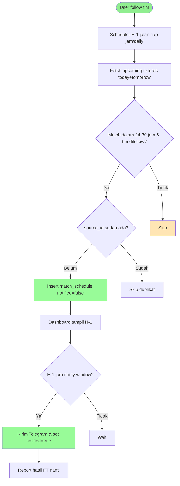

# Feature Specification: Simpan Jadwal H-1 Pertandingan Mendatang

**Feature Branch**: `001-jadwal-h-1`  
**Created**: 2026-08-27  
**Status**: Draft  
**Input**: User description: "ingin membuat penjadwalan agar bisa menyimpan jadwal pertandingan mendatang. jadwal yang disimpan adalah 1 hari sebelum pertandingan."

## User Scenarios & Testing

### User Story 1 - Jadwal tersimpan H-1 sebelum kickoff (Priority: P1)

User follow tim (football/volly/motogp). Sistem simpan jadwal ke `match_schedule` 24 jam sebelum pertandingan, tanpa kirim notifikasi. Notifikasi tetap H-1 jam seperti sekarang.

**Why this priority**: Inti request. Jadwal harus ada H-1 hari untuk dilihat/dashboard sebelum notif.

**Independent Test**: Follow tim A, mock fixture besok 2026-08-28 20:00 WIB. Jalankan scheduler H-1. Cek `match_schedule` ada row `match_time=2026-08-28T20:00:00`, `status=NS`, `notified=false`, `source_id` per-user. Poll lagi tidak duplikat.

**Acceptance Scenarios**:

1. **Given** ada fixture football besok yang tim-nya difollow user, **When** job H-1 jalan hari ini, **Then** row tersimpan dengan `match_time` asli dan `notified=false`
2. **Given** fixture sudah tersimpan H-1, **When** `bot:notify` jalan H-1 jam sebelum kickoff, **Then** notifikasi terkirim dan row di-update `notified=true` (atau reuse row)
3. **Given** fixture lebih dari 24-30 jam lagi, **When** job H-1 jalan, **Then** tidak disimpan (tunggu besok)
4. **Given** fixture sudah lewat / dibatalkan (`status != NS`), **When** job jalan, **Then** skip

---

### User Story 2 - Tidak duplikat & idempotent (Priority: P1)

Scheduler jalan tiap jam/hari, tidak buat duplikat walau API return fixture yang sama dua hari berturut.

**Independent Test**: Jalankan job 2x dalam 5 menit untuk fixture sama → hanya 1 row di DB (unique `source_id`+`sport_type`).

**Acceptance Scenarios**:

1. **Given** row sudah ada untuk `source_id` itu, **When** job jalan lagi, **Then** skip insert
2. **Given** API return fixture dengan `id` sama di fetch today & tomorrow, **When** deduplicate, **Then** simpan sekali

---

### User Story 3 - Cakupan semua sport yang difollow (Priority: P2)

Sama seperti US1 tapi untuk volly & motogp (klasifikasi motogp/moto2/moto3/baggers).

**Independent Test**: Follow entity volly & motogp, mock upcoming volly besok → row volly tersimpan.

**Acceptance Scenarios**:

1. **Given** user follow tim volly yang main besok, **When** job jalan, **Then** tersimpan dengan `sport_type=volly`
2. **Given** race MotoGP besok yang raceName match entity_name, **When** job jalan, **Then** tersimpan `sport_type=classification` (motogp dll)

---

### Edge Cases

- API key kosong / quota habis → log error ke owner, jangan crash scheduler; retry next run
- Fixture `date` kosong / parse gagal → skip fixture itu, lanjut lain
- Timezone: API return UTC, `match_time` simpan UTC (ATOM), `startsSoon` tetap UTC vs `now` UTC
- User unfollow setelah H-1 tersimpan → row tetap ada (tidak delete), notif tidak terkirim karena pref hilang
- Fixture di-reschedule oleh provider (waktu berubah) → update `match_time` jika `source_id` sudah ada tapi `match_time` beda? (P1: skip update dulu, add when needed)
- `source_id` tetap format `{apiId}:u{userId}` supaya `reportResults` & deduplicate konsisten dengan `MatchNotifier.php:204`

## Requirements

### Functional Requirements

- **FR-001**: System MUST simpan fixture/race yang kickoff dalam 24-30 jam ke depan (± jendela H-1) ke `match_schedule` dengan `status=NS`, `notified=false`, `match_time` = waktu asli fixture
- **FR-002**: System MUST deduplicate via `source_id` (`MatchNotifier.php:204`) + `sport_type` — jika sudah ada, skip insert
- **FR-003**: System MUST hanya simpan untuk `sport_type` yang ada di `sport_preferences` aktif per user (via `SportPrefsService`), matching pakai `NameMatcher::matches` (football/volly) dan `MotoGPService::matchesRace` (motogp)
- **FR-004**: System MUST jalan sebagai scheduled job (artisan command + `Schedule`), idempotent, `withoutOverlapping`
- **FR-005**: System MUST reuse `FootballService::getUpcomingFixtures` / `VolleyballService::getUpcomingGames` / `MotoGPService::getCurrentSeasonRaces` sebagai sumber; tidak duplikat HTTP logic
- **FR-006**: System MUST simpan football/volly dengan shape `home_team/away_team/competition=league` dan motogp dengan `home_team=circuitName, away_team=locality,country, competition=raceName` konsisten dengan `MatchNotifier.php:93,137`
- **FR-007**: System MUST log jumlah tersimpan / skip per sport, dan report error ke owner via `TelegramService` seperti `MatchNotifier.php:54`

### Non-Functional Requirements

- **NFR-001**: Scheduler tidak tambah API call melebihi quota (reuse cache `football.upcoming` 3 jam; motogp/volly sesuai existing)
- **NFR-002**: Job idempotent & tidak bikin duplikat walau overlap (DB unique via select-check)

### Key Entities

- **match_schedule**: row per-user per-match mendatang
  - Key attributes: `source_id` (apiId:uUserId), `sport_type`, `competition`, `home_team`, `away_team`, `match_time` (timestamptz UTC), `status` (NS/FT), `notified` (bool)
  - Owns: notifikasi state
  - State lifecycle: NS/notified false (H-1 tersimpan) → NS/notified true (H-1 jam notif) → FT (hasil dilaporkan)
  - Relationships: `sport_preferences` (via matching), `SupabaseService` insert/select

- **sport_preferences**: preferensi follow per user (existing)
  - Key attributes: `user_id`, `sport_type`, `entity_name`
  - Relationships: drives which fixtures disimpan

## Success Criteria

- **SC-001**: Fixture yang kickoff besok muncul di `match_schedule` maksimal 1 jam setelah scheduler H-1 jalan hari ini
- **SC-002**: Tidak ada duplikat `source_id+sport_type` setelah job jalan 2x berturut
- **SC-003**: Notifikasi H-1 jam tetap terkirim tepat (reuse row yang sudah ada, update `notified`)
- **SC-004**: `composer test` hijau, job ter-schedule dan terlihat di `php artisan schedule:list`

## UI/UX & Screens

Tidak ada UI baru. Jadwal H-1 hanya backend (DB). Dashboard yang sudah ada baca `match_schedule` akan otomatis lihat jadwal lebih awal.

### Design Reference

- **Design source**: none — follow existing design system (Emerald Nocturne)
- **Look & feel**: N/A
- **Existing UI to match**: Existing schedule list di dashboard

### Screen Inventory

| Screen | Purpose | Serves story | Key data shown | Primary actions |
| ------ | ------- | ------------ | -------------- | --------------- |
| Dashboard schedule | Lihat jadwal mendatang | US1 | match_schedule rows | read |

### Per-Screen Key States

- **Dashboard schedule**: loading = spinner; empty = "Belum ada jadwal"; error = retry; populated = list jadwal H-1+

### Primary Interactions & Flows

- Scheduler insert H-1 → dashboard query `match_schedule` where `status=NS` → tampil
- Notifier H-1 jam update same row `notified=true`

## Business Process Flow

### Primary User Journey Flow

## Business Actors & Interactions

| Actor | Role | Key Interactions |
| ----- | ---- | ---------------- |
| User | Follower tim | Follow entity, lihat jadwal H-1 di dashboard, terima notif H-1 jam |
| Scheduler | System | Fetch fixture, match pref, insert H-1 |
| Notifier | System | Kirim notif H-1 jam, update row |
| API-Football/Volley/MotoGP | Provider | Sumber jadwal |
