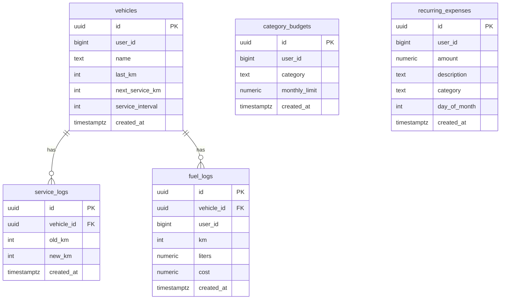

# Data Model: Wave2 Migration

**Branch**: `002-wave2-migration` | **Spec**: `specs/002-wave2-migration/spec.md` | **Source**: `supabase/wave2.sql`

## Entities (mirror source 1:1)

### category_budgets

- **Represents**: anggaran bulanan per user per kategori
- **Key attributes**: id uuid PK default `gen_random_uuid()` (Supabase) / string uuid (Laravel), user_id bigint NOT NULL, category text NOT NULL, monthly_limit numeric CHECK 0-100jt NOT NULL, created_at timestamptz default now()
- **Owns**: —
- **State**: active (unique user_id, category)
- **Relationships**: logical user_id → users, unique(user_id, category)
- **Validation**: monthly_limit 0–100M, category required

### recurring_expenses

- **Attributes**: id uuid PK, user_id bigint NOT NULL, amount numeric 0-100M NOT NULL, description text 1-200 NOT NULL, category text <=30 default 'General' NOT NULL, day_of_month int 1-31 NOT NULL, created_at
- **Relationships**: user_id → users

### vehicles

- **Attributes**: id uuid PK, user_id bigint NOT NULL, name text 1-50 NOT NULL, last_km int 0-9999999 NOT NULL, next_service_km int 0-9999999 NOT NULL, service_interval int 500-20000 default 2000 NOT NULL, created_at
- **Owns**: service_logs, fuel_logs (1:N)
- **Relationships**: user_id → users

### service_logs

- **Attributes**: id uuid PK, vehicle_id uuid FK → vehicles.id ON DELETE CASCADE NOT NULL, old_km int nullable, new_km int nullable, created_at
- **Relationships**: many-to-one vehicles
- **Test for cascade**: `tests/Feature/Wave2MigrationTest.php` must assert `DELETE vehicles` cascades `service_logs` via SQLite mirror.

### fuel_logs

- **Attributes**: id uuid PK, vehicle_id uuid FK → vehicles.id CASCADE NOT NULL, user_id bigint nullable, km int 0-9999999 NOT NULL, liters numeric 0.1-1000 NOT NULL, cost numeric nullable 0-100M (check `cost is null or ...`), created_at
- **Relationships**: vehicle_id → vehicles

## Operational additions (not entity)

- **GRANT**: `GRANT ALL ON public.{category_budgets, recurring_expenses, vehicles, service_logs, fuel_logs} TO service_role, authenticated;` — not a table, but privilege required.

## SQLite mapping deviations

| Supabase | Laravel SQLite mirror | Reason |
| -------- | --------------------- | ------ |
| `uuid primary key default gen_random_uuid()` | `uuid('id')->primary()` (string) | SQLite no pgcrypto; app generates via `Str::uuid()` |
| `numeric` | `decimal(10,2)` or `decimal(15,2)` | SQLite affinity |
| `timestamptz default now()` | `timestamps` / `timestampTz('created_at')->useCurrent()` | SQLite compat |
| `text check (char_length(...))` | `string()->check` via validation layer (SQLite check limited) | keep check in app or raw `CHECK` |

## ERD

