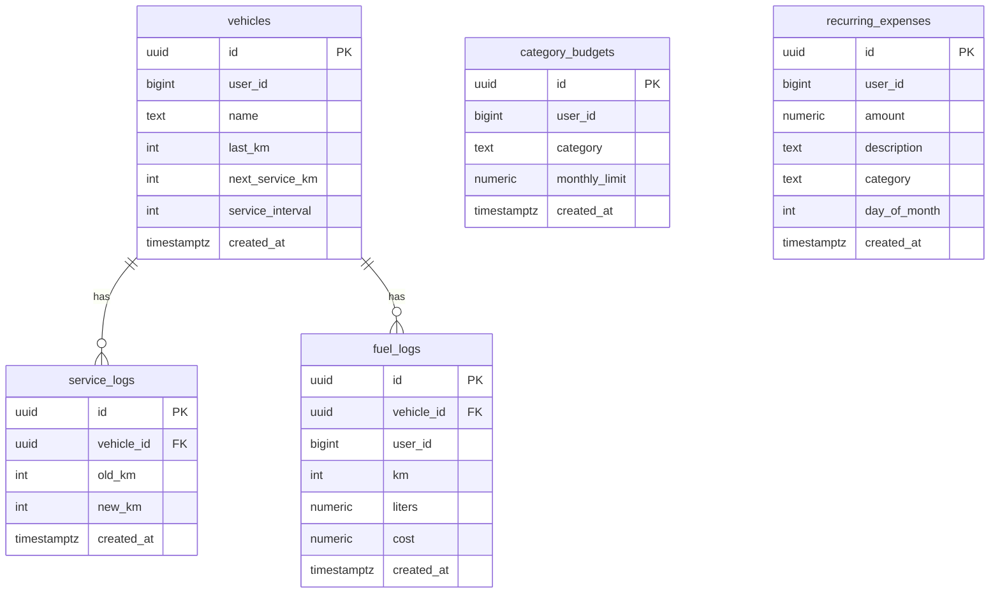
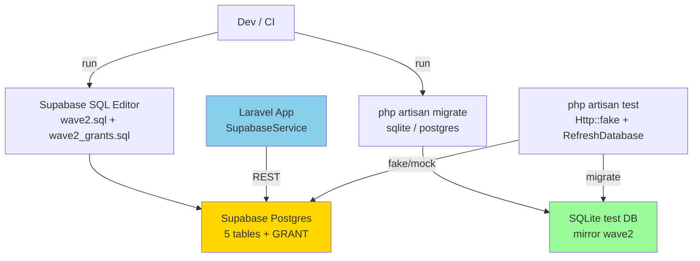
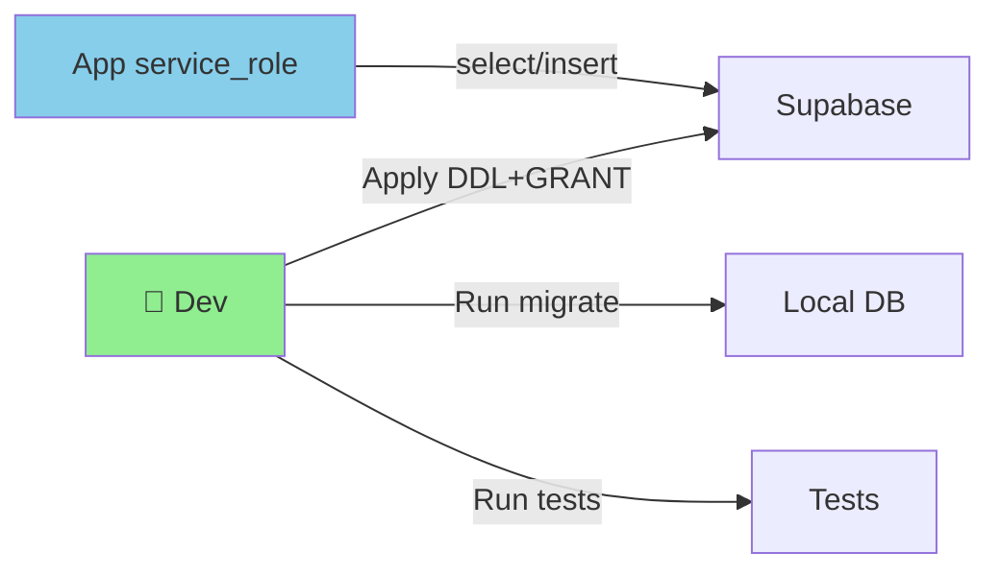
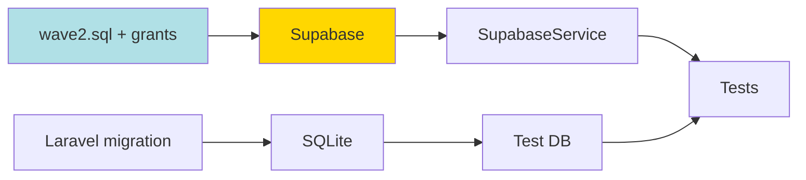
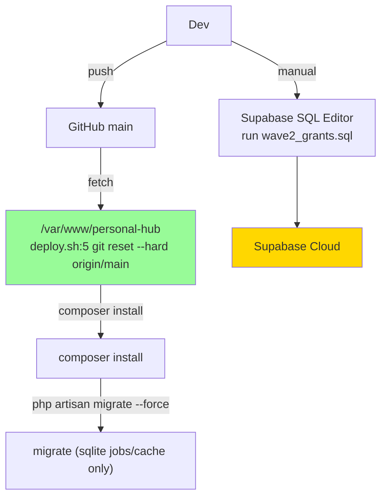

# Implementation Plan: Wave2 Migration — Supabase Grants & Laravel Mirrors

**Branch**: `002-wave2-migration` | **Date**: 2026-08-28 | **Spec**: `specs/002-wave2-migration/spec.md`
**Input**: Feature specification from `specs/002-wave2-migration/spec.md`

## Summary

Wave2 DDL (`supabase/wave2.sql`) sudah buat 5 tabel tapi `service_role` kena `42501 permission denied` karena tanpa `GRANT`. Plan: tambah file `supabase/wave2_grants.sql` idempotent grant ke 5 tabel, dan mirror yang sama sebagai Laravel migrations `database/migrations/*_wave2_*.php` untuk SQLite lokal (`DB_CONNECTION=sqlite`) sehingga `php artisan migrate` + `php artisan test` hijau tanpa mock Supabase. Tidak ada UI.

## Technical Context

**Language/Version**: PHP 8.3, Laravel 13  
**Primary Dependencies**: SupabaseService (Rest API via Http), Illuminate Database Migrations, phpunit 12  
**Storage**: Supabase Postgres (prod) + SQLite in-memory (`phpunit.xml` DB_CONNECTION=sqlite)  
**Testing**: PHPUnit 12, `Http::fake` untuk Supabase Rest, `RefreshDatabase` optional untuk SQLite mirror  
**Target Platform**: Linux server (`deploy.sh:3` `/var/www/personal-hub` — `git fetch + artisan migrate --force`) + Supabase Cloud  
**Project Type**: Web application — monolith Laravel + Vue SPA  
**Architecture Type**: Monolith — single Laravel app (no ModuleFederationPlugin, no webpack federated, no `single-spa`, one `composer.json` root) — **N/A Integration Target**  
**Integration Target**: N/A — standalone monolith, no host shell  
**Existing Design System**: None for this feature — backend migration only; repo frontend is Tailwind 4 + Emerald Nocturne (`resources/css/app.css` `@theme`) + Lucide icons, but this plan touches no screens — carry spec's "no UI"  
**Performance Goals**: N/A — migration <2s, grant re-run <500ms  
**Constraints**: `DB_CONNECTION=sqlite` di `.env:20` → SQLite tidak punya `pgcrypto`/`gen_random_uuid()`; mirror pakai string uuid. Supabase `RLS stays off` per constitution — no policies.  
**Scale/Scope**: 5 tables wave2 (`category_budgets`, `recurring_expenses`, `vehicles`, `service_logs`, `fuel_logs`)

## UI/UX & Screens (carried from spec)

- **Design reference**: none — backend migration only, follow existing repo (Emerald Nocturne not used)
- **Screens**: none new
- **Primary interactions/flows**: Dev run `supabase/wave2_grants.sql` di SQL Editor → `SupabaseService->select` 200; dev run `php artisan migrate` → sqlite tables exist → tests pass

## Constitution Check

*GATE: Must pass before Phase 0 research. Re-check after Phase 1 design.*

- **I. External Data Only**: PASS — Supabase grant fix is prod path; Laravel mirror ONLY for `sqlite` test DB (`phpunit.xml`), not for app data. No Eloquent local model for prod.
- **II. Single-Owner Scope**: PASS — no change.
- **III. Tests Ship With Changes**: PASS — will add migration + grant verification test.
- **IV. One Handler Path**: PASS — no business logic duplication.
- **V. Timezone Discipline**: PASS — `timestamptz default now()` UTC; no schedule change.
- **VI. Simplicity Over Speculation**: PASS — minimal grant + 1-2 migration files, no abstraction.

## Project Structure

### Documentation (this feature)

```text
specs/002-wave2-migration/
├── plan.md              # This file
├── research.md          # Phase 0 output
├── data-model.md        # Phase 1 output
├── quickstart.md        # Phase 1 output
├── contracts/           # empty — no new API
└── tasks.md             # Phase 2 output (NOT created by /pandawa.plan)
```

### Source Code (repository root)

```text
supabase/
├── wave2.sql            # existing — idempotent DDL, untouched
└── wave2_grants.sql     # NEW — idempotent GRANTs for 5 tables

database/
└── migrations/
    ├── 0001_01_01_000000_create_users_table.php
    ├── 0001_01_01_000001_create_cache_table.php
    ├── 0001_01_01_000002_create_jobs_table.php
    └── 2026_08_28_000000_create_wave2_tables.php  # NEW — mirror wave2 for sqlite

tests/
├── Feature/Wave2MigrationTest.php  # NEW — verify migrate + Supabase fake
└── Unit/... (if needed)
```

**Structure Decision**: Laravel standard `database/migrations` + `supabase/*.sql` idempotent. Single file `2026_08_28_000000_create_wave2_tables.php` bundles 5 tables with FK (ponytail: one migration vs 5 files — simpler to land, add when need per-table rollback).

## Complexity Tracking

| Violation | Why Needed | Simpler Alternative Rejected Because |
| --------- | ---------- | ------------------------------------ |
| I. External Data Only — SQLite mirror `database/migrations/2026_08_28_000000_create_wave2_tables.php` | Test/CI only (`phpunit.xml` DB_CONNECTION=sqlite), prod data stays Supabase REST per `constitution.md:I` | No mirror → tests must Http::fake only, loses FK cascade coverage |

---

## Technical Diagrams

### Data Design Decisions

| Source resource / sub-resource | Table(s) | Mapping | Rationale |
| ------------------------------ | -------- | ------- | --------- |
| category_budgets | category_budgets | mirror — 1:1 dari wave2.sql:7 | DDL source exact |
| recurring_expenses | recurring_expenses | mirror | — |
| vehicles | vehicles | mirror | — |
| service_logs (FK vehicles.id CASCADE) | service_logs | mirror (child) | sub-resource 1:N |
| fuel_logs (FK vehicles.id CASCADE) | fuel_logs | mirror (child) | sub-resource 1:N |
| grants (operational, not entity) | GRANT ALL ON 5 tables TO service_role | operational addition | constitution RLS off, need privilege |
| sqlite uuid PK default | Laravel mirror: `uuid('id')->primary()` tanpa `gen_random_uuid()` | deviation: sqlite-compatible | SQLite no `pgcrypto`; app generates UUID via model/Str::uuid() |

### Data Model (Entity Relationship Diagram)



### System Architecture



### Use Case Diagram



### Data Flow Diagram (Level 0)



### API Contract Overview

| Operation | Endpoint | Method | Purpose |
| --------- | -------- | ------ | ------- |
| — | — | — | No new API — migration only (existing Supabase REST `/rest/v1/<wave2 table>`) |

### Deployment Architecture


