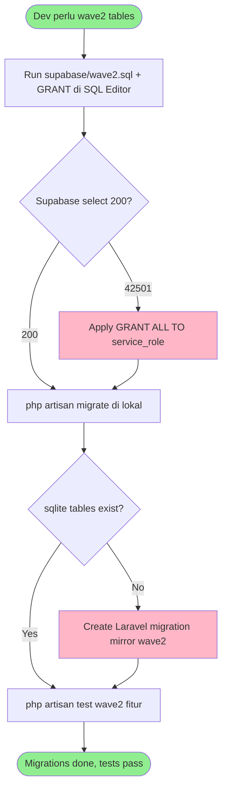

# Feature Specification: Wave2 Migration — Supabase Grants & Laravel Mirrors

**Feature Branch**: `002-wave2-migration`  
**Created**: 2026-08-28  
**Status**: Draft  
**Input**: User description: "sql pada wave2.sql buatkan file migrationnya dan jalankan kemudian test fitur terkait"

## User Scenarios & Testing

### User Story 1 - Supabase wave2 tables dapat diakses service_role (Priority: P1)

Sebagai app (service_role), saya bisa `select/insert` ke 5 tabel wave2 tanpa `42501 permission denied`. Saat ini `supabase/wave2.sql` sudah membuat tabel tapi tidak ada `GRANT`, sehingga `SupabaseService.php:33` kena `permission denied for table vehicles` (verified via `php artisan tinker --execute "select vehicles"`). Fix harus idempotent dan aman re-run.

**Why this priority**: P1 — semua fitur budgets/recurring/vehicles mati di prod tanpa grant; ini root cause sesi sebelumnya.

**Independent Test**: Jalankan `php artisan tinker --execute "(new SupabaseService)->select('vehicles',['select'=>'id','limit'=>1])"` dan 4 tabel lain — sebelum fix `42501`, setelah fix `200` dengan array (empty ok). Re-run migration/grant dua kali tetap sukses, data lama tidak hilang.

**Acceptance Scenarios**:

1. **Given** `vehicles` sudah dibuat oleh `wave2.sql` tapi belum di-grant, **When** app `select('vehicles')`, **Then** `42501` → setelah migration grant dijalankan, `select` return `200` (empty array jika belum ada data).
2. **Given** migration grant sudah jalan, **When** dijalankan lagi (idempotent), **Then** tidak error dan tidak duplikat/drop data.
3. **Given** `category_budgets`/`recurring_expenses`/`service_logs`/`fuel_logs` sama, **When** `select` masing-masing, **Then** semua `200`.

---

### User Story 2 - Laravel migration mirror untuk test lokal (Priority: P1)

Sebagai dev, `php artisan migrate` di SQLite lokal (test/CI) bisa buat 5 tabel wave2 yang mirror Supabase schema, sehingga `php artisan test` yang butuh tabel lokal (jika ada) tidak skip. Saat ini `database/migrations` hanya 3 file framework (`users`, `cache`, `jobs`), tidak ada wave2.

**Why this priority**: P1 — tanpa mirror, test fitur budgets/vehicles harus mock Supabase HTTP; dengan mirror, bisa pakai `RefreshDatabase` SQLite sederhana.

**Independent Test**: `php artisan migrate:fresh --env=testing` → 5 tabel baru ada di `sqlite` (`sqlite_master` contains `category_budgets` etc). `php artisan migrate:status` shows 5 baru `Ran`. Re-run `migrate` idempotent. `php artisan migrate:rollback` drop wave2 tables.

**Acceptance Scenarios**:

1. **Given** DB kosong, **When** `php artisan migrate`, **Then** `category_budgets`, `recurring_expenses`, `vehicles`, `service_logs`, `fuel_logs` tercipta dengan kolom + constraint sesuai `wave2.sql`.
2. **Given** sudah migrate, **When** `php artisan migrate` lagi, **Then** `Nothing to migrate` (tidak duplikat).
3. **Given** `vehicles` punya FK `service_logs.vehicle_id`, **When** insert `service_logs` dengan `vehicle_id` invalid, **Then** FK violation (enforce `on delete cascade`).

---

### User Story 3 - Fitur terkait wave2 ter-test (Priority: P2)

Sebagai QA, fitur yang pakai 5 tabel wave2 (budgets, recurring, vehicles, service/fuel logs) punya test yang pass lewat Supabase mock atau SQLite mirror, sehingga regresi ketahuan sebelum deploy.

**Why this priority**: P2 — validasi end-to-end setelah migration jalan.

**Independent Test**: `php artisan test --filter=Budget|Recurring|Vehicle` → semua hijau tanpa `42501`. `Http::fake` untuk Supabase path `*rest/v1/category_budgets*` return 200.

**Acceptance Scenarios**:

1. **Given** budgets endpoint/controller ada, **When** test create `category_budgets` via service/HTTP fake, **Then** `201`/`200` dan `select` balik data.
2. **Given** vehicle `V` ada + `service_logs` `S` dengan `S.vehicle_id=V.id`, **When** `DELETE FROM vehicles WHERE id=V.id`, **Then** `S` hilang (`ON DELETE CASCADE`), dan insert `service_logs` dengan `vehicle_id` invalid → FK violation.

---

### Edge Cases

- Wave2 SQL sudah pernah di-run sebagian → migration harus `IF NOT EXISTS` + grant idempotent (`GRANT ...` tanpa `IF NOT EXISTS` tetap aman re-run; Postgres `GRANT` idempotent).
- Supabase RLS off (constitution: `supabase RLS stays off while service_role`) → jangan `ENABLE ROW LEVEL SECURITY`; cukup `GRANT`.
- SQLite tidak support `pgcrypto`/`gen_random_uuid()`/`uuid` PK default → Laravel mirror pakai `string`/`char(36)` atau `uuid` via `Str::uuid()` application level; `gen_random_uuid()` di Supabase tetap, di SQLite pakai `default('')` + model generate.
- `fuel_logs.cost` nullable numeric check `cost is null or ...` → mirror di Laravel pakai `decimal()->nullable()`.
- `vehicles.service_interval` default 2000 antara 500-20000 → mirror pakai `integer()->default(2000)`.
- Migration run di prod Supabase harus via SQL Editor, bukan `php artisan migrate` (local only). Dokumentasikan di `supabase/README` atau comment header.

## Requirements

### Functional Requirements

- **FR-001**: System MUST membuat/verify 5 tabel Supabase `category_budgets`, `recurring_expenses`, `vehicles`, `service_logs`, `fuel_logs` dengan kolom + check + FK persis `supabase/wave2.sql:7` (id uuid PK `gen_random_uuid`, user_id bigint, amount/category/day_of_month, dll).
- **FR-002**: System MUST grant `ALL` (atau minimal `SELECT, INSERT, UPDATE, DELETE`) pada 5 tabel ke `service_role` (dan `authenticated` jika dipakai) sehingga `SupabaseService` tidak `42501`. Grant harus idempotent re-run.
- **FR-003**: System MUST menyediakan Laravel migration file(s) di `database/migrations` yang mirror schema wave2 untuk SQLite/Postgres lokal, idempotent, dengan `up()` create + `down()` drop, dan `php artisan migrate:status` shows Ran.
- **FR-004**: System MUST jalankan migration (Supabase grant + Laravel migrate) tanpa kehilangan data existing (`IF NOT EXISTS` / `Schema::hasTable` guard).
- **FR-005**: System MUST punya test yang verifikasi fitur wave2 terkait dapat `select/insert` tanpa `42501` (via `Http::fake` Supabase atau SQLite `RefreshDatabase`).

### Non-Functional Requirements

- **NFR-001**: Migration idempotent — re-run 2x hasil sama, tidak error, tidak duplikat.
- **NFR-002**: `php artisan test` tetap hijau, `pint` pass, `npm run build` tidak broken (jika tidak ada frontend wave2, no-op).

### Key Entities

- **category_budgets**: anggaran per user per kategori
  - Key attributes: id uuid PK, user_id bigint, category text, monthly_limit numeric 0-100jt, created_at timestamptz
  - Owns: —
  - State lifecycle: created → updated (limit changed)
  - Relationships: user_id → users (logical), unique(user_id, category)

- **recurring_expenses**: pengeluaran berulang bulanan
  - Key attributes: id uuid PK, user_id bigint, amount numeric, description text 1-200, category text, day_of_month int 1-31, created_at
  - Relationships: user_id → users

- **vehicles**: kendaraan user
  - Key attributes: id uuid PK, user_id bigint, name text 1-50, last_km int, next_service_km int, service_interval int 500-20000 default 2000, created_at
  - Owns: service_logs, fuel_logs (1..*)
  - Relationships: user_id → users

- **service_logs**: riwayat servis per vehicle
  - Key attributes: id uuid PK, vehicle_id uuid FK → vehicles.id CASCADE, old_km int, new_km int, created_at
  - Relationships: vehicle_id → vehicles

- **fuel_logs**: log isi bensin
  - Key attributes: id uuid PK, vehicle_id uuid FK → vehicles.id CASCADE, user_id bigint, km int, liters numeric 0.1-1000, cost numeric nullable 0-100jt, created_at
  - Relationships: vehicle_id → vehicles

## Success Criteria

- **SC-001**: `SupabaseService->select` ke 5 tabel wave2 return `200` (bukan `42501`) — verified via `tinker` dan via `Http::fake` di test.
- **SC-002**: `php artisan migrate` + `php artisan migrate:status` shows semua wave2 migrations `Ran`, `migrate:fresh` recreate tanpa error.
- **SC-003**: `php artisan test` hijau (wave2-related tests pass) dan `vendor/bin/pint --test` pass.
- **SC-004**: Re-run migration/grant 2x tidak error dan data tidak hilang (idempotent).

## UI/UX & Screens

Tidak ada UI baru — migration only. Jika ada halaman Budget/Vehicle yang pakai tabel ini, tidak berubah di fase ini; cuma backend persistance yang diperbaiki.

### Design Reference

- **Design source**: none — follow existing Emerald Nocturne, tidak ada screen baru
- **Look & feel**: N/A
- **Existing UI to match**: `supabase/wave2.sql` adalah source of truth untuk DDL

### Screen Inventory

| Screen | Purpose | Serves story | Key data shown | Primary actions |
| ------ | ------- | ------------ | -------------- | --------------- |
| (none new) | — | US1/US2 | — | — |

### Per-Screen Key States

- N/A

### Primary Interactions & Flows

- Dev run `supabase/wave2.sql` + grant di SQL Editor → app bisa `SupabaseService->select`
- Dev run `php artisan migrate` → tabel lokal tercipta → test pass

## Business Process Flow

### Primary User Journey Flow

## Business Actors & Interactions

| Actor | Role | Key Interactions |
| ----- | ---- | ---------------- |
| Dev | Migration author | Buat file `database/migrations/*_wave2_*.php`, buat `supabase/wave2_grants.sql`, run `php artisan migrate`, test |
| App (service_role) | Consumer | `SupabaseService->select/insert` ke 5 tabel wave2 |
| Supabase | DB | Eksekusi DDL + GRANT |
| Test runner | Verification | `php artisan test` verifikasi fitur wave2 |

## Assumptions

- Wave2 SQL di `supabase/wave2.sql` adalah authoritative DDL — tidak diubah, hanya ditambah grant/mirror.
- RLS tetap OFF (constitution) — tidak perlu `ENABLE RLS` / policies.
- Laravel mirror pakai SQLite-compatible types (uuid sebagai string) karena `DB_CONNECTION=sqlite` di `.env:20`.
