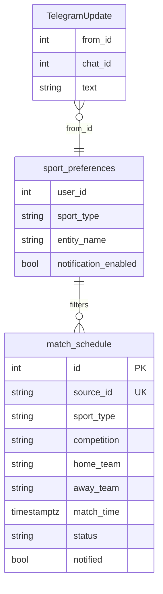
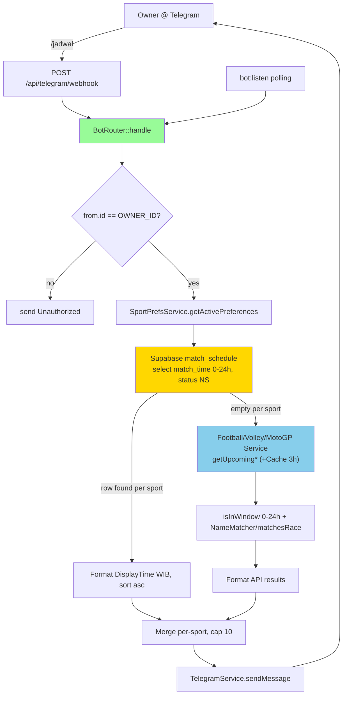
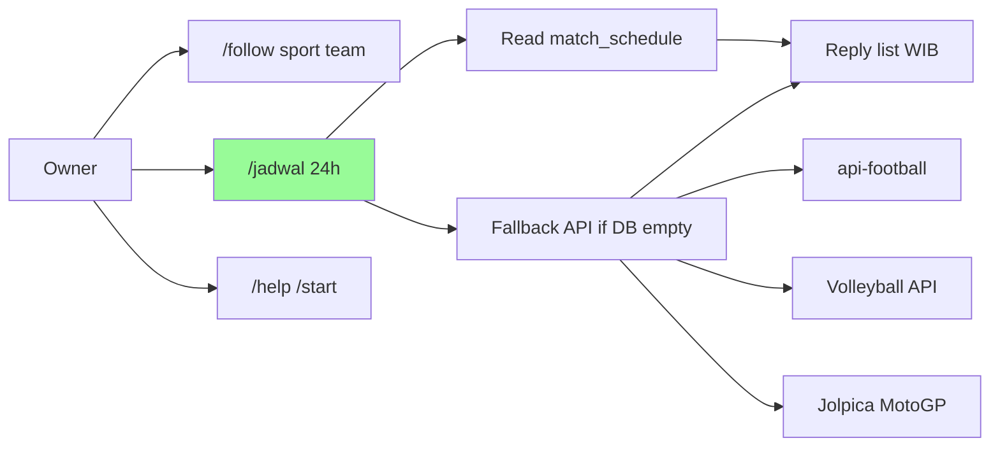
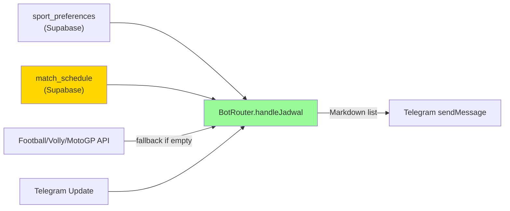
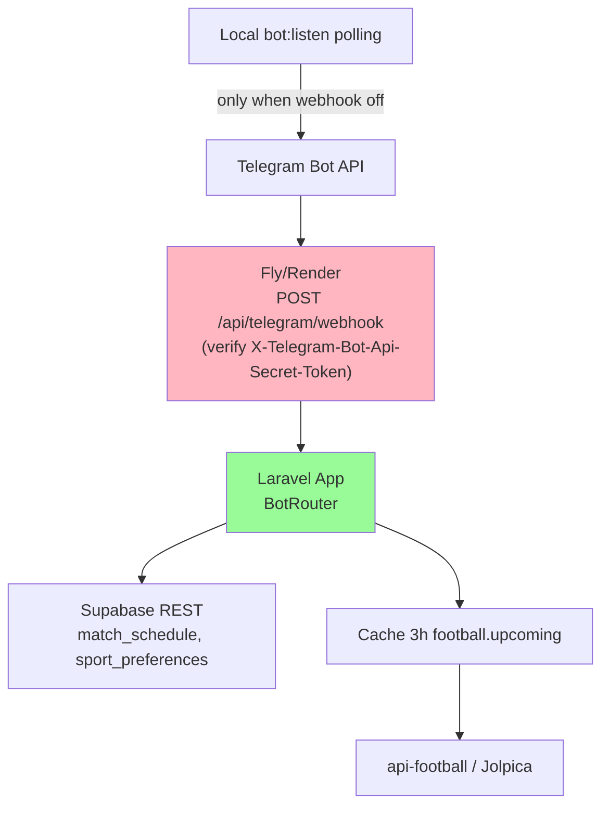

# Implementation Plan: Cek Jadwal Pertandingan 1 Hari via Telegram Bot (DB-first, API fallback)

**Branch**: `003-cek-jadwal-bot` | **Date**: 2026-08-27 | **Spec**: `specs/003-cek-jadwal-bot/spec.md`
**Input**: Feature specification from `specs/003-cek-jadwal-bot/spec.md`

## Summary

Tambah command Telegram `/jadwal` (alias `/schedule`, `/next`) yang menjawab jadwal kickoff 0–24 jam ke depan untuk tim/balapan yang difollow. Cek `match_schedule` dulu (hasil `bot:schedule` H-1) per-sport; jika kosong, fallback hit API langsung (`FootballService::getUpcomingFixtures`, `VolleyballService`, `MotoGPService`) dengan filter `MatchHelper::isInWindow(now, now+24h)` + `NameMatcher`/`matchesRace`. Display WIB via `DisplayTime`, urut asc, cap 10. Menu `/` dan `/help` diupdate.

## Technical Context

**Language/Version**: PHP 8.3, Laravel 13  
**Primary Dependencies**: BotRouter, TelegramService, SupabaseService, SportPrefsService, FootballService, VolleyballService, MotoGPService, NameMatcher, MatchHelper, DisplayTime  
**Storage**: Supabase Postgres `match_schedule` (REST, read-only) + `sport_preferences`; Cache `football.upcoming` 3h, `football.teams.*` 1d  
**Testing**: PHPUnit 12, SQLite in-memory (framework only) — mock SupabaseService/FootballService via DI or partial mock  
**Target Platform**: Laravel artisan BotRouter (webhook prod `POST /api/telegram/webhook` + polling `bot:listen` dev), Telegram Bot API  
**Project Type**: Web app monolith (Laravel+Vue SPA + Telegram bot)  
**Architecture Type**: Monolith — single Laravel app serving SPA catch-all (`routes/web.php`) + API (`routes/api.php`) + Console Commands  
**Integration Target**: Telegram `sendMessage`/`setMyCommands`, Supabase REST `match_schedule`/`sport_preferences`, api-football.com, Jolpica F1/MotoGP, volleyball provider  
**Existing Design System**: Bot-only — Telegram Markdown + emoji (`⚽`/`🏐`/`🏍️`) matching `MatchNotifier` style; dashboard Emerald Nocturne (Tailwind 4 `@theme`) tidak tersentuh  
**Performance Goals**: Reply <3s (DB path), <5s (API fallback); Telegram webhook must answer 200 quickly  
**Constraints**: 100 req/day api-football free plan → reuse `football.upcoming` cache; HTTP timeout 15s (`SupabaseService::TIMEOUT`); webhook must answer 200 even on error (hindari redelivery); single-owner `OWNER_ID` whitelist  
**Scale/Scope**: 1 user (`OWNER_ID`) awal, multi-user ready via `source_id:uUserId`; ~5–20 fixtures/day

## UI/UX & Screens (carried from spec)

- **Design reference**: none — follow existing bot Markdown style (`MatchNotifier` emoji + `DisplayTime` WIB)
- **Screens**:
  - Telegram chat `/jadwal` → purpose cek jadwal 1 hari → key states: loading none (sync), empty "📭 Tidak ada jadwal...", error "⚠️ Gagal ambil...", populated header "📅 Jadwal 24 jam ke depan" + list asc max 10 per sport (`emoji home vs away • competition • ⏱️ WIB`)
  - Menu `/` → discoverability → list `jadwal — Cek jadwal 1 hari ke depan`
- **Primary interactions/flows**: `/jadwal`/`/schedule`/`/next` → `BotRouter::handle()` → `handleJadwal(uid,cid)` → prefs → `match_schedule` 0–24h → per-sport API fallback → format → `TelegramService::sendMessage`

## Constitution Check

*GATE: Must pass before Phase 0 research. Re-check after Phase 1 design.*

- [x] I. External Data Only — `match_schedule` via `SupabaseService` HTTP, no local Eloquent app table
- [x] II. Single-Owner Scope — `from.id != OWNER_ID` → unauthorized, no multi-tenant expansion
- [x] III. Tests Ship With Changes — add `tests/Feature/BotRouterJadwalTest.php` + `tests/Unit/MatchHelperWindowTest.php`, `composer test` green
- [x] IV. One Handler Path — `BotRouter` shares `SportPrefsService`/`FootballService`/`MatchHelper` with `MatchNotifier`/`MatchScheduler`; no duplicated HTTP logic
- [x] V. Timezone Discipline — filter UTC `isInWindow(UTC)`, display WIB `DisplayTime::format` via `display_timezone=Asia/Jakarta`
- [x] VI. Simplicity Over Speculation — reuse `MatchHelper::isInWindow`, no new cache layer, no write on `/jadwal`
- Constraints: secrets via `config/services.php`; webhook 200 even on error; HTTP 15s timeout; cache football 3h
- Gate: PASS — no violation

## Project Structure

### Documentation (this feature)

```text
specs/003-cek-jadwal-bot/
├── spec.md
├── plan.md              # This file
├── research.md          # Phase 0 output
├── data-model.md        # Phase 1 output
├── quickstart.md        # Phase 1 output
├── contracts/           # Phase 1 output (bot command contract)
└── tasks.md             # Phase 2 output (NOT created by /pandawa.plan)
```

### Source Code (repository root)

```text
app/
├── Console/Commands/
│   ├── TelegramBot.php        # existing polling
│   ├── MatchNotifier.php      # existing
│   ├── MatchScheduler.php     # existing H-1
│   └── RegisterWebhook.php    # existing — publish MENU
├── Services/
│   ├── BotRouter.php          # MOD: add MENU jadwal + handleJadwal
│   ├── SupabaseService.php    # reuse
│   ├── SportPrefsService.php  # reuse
│   ├── FootballService.php    # reuse
│   ├── VolleyballService.php  # reuse
│   ├── MotoGPService.php      # reuse
│   ├── TelegramService.php    # reuse
│   ├── DisplayTime.php        # reuse
│   └── NameMatcher.php        # reuse
├── Support/
│   └── MatchHelper.php        # MOD: add isNext24Hours helper or reuse isInWindow
└── Http/Controllers/Api/
    └── TelegramWebhookController.php  # existing webhook, no change (delegates to BotRouter)

tests/
├── Feature/
│   └── BotRouterJadwalTest.php   # NEW
└── Unit/
    └── MatchHelperWindowTest.php # NEW (or extend MatchHelperTest)
```

**Structure Decision**: Monolith Laravel — tambah handler di `BotRouter` (single router untuk webhook+polling), tambah helper `isNext24Hours` di `MatchHelper`, update `MENU`/`WELCOME` dan `RegisterWebhook` publish. Tidak ada controller baru.

## Complexity Tracking

| Violation | Why Needed | Simpler Alternative Rejected Because |
| --------- | ---------- | ------------------------------------ |
| none | — | — |

---

## Technical Diagrams

### Data Design Decisions

| Source resource / sub-resource | Table(s) | Mapping | Rationale |
| ------------------------------ | -------- | ------- | --------- |
| `match_schedule` (per-user per-match) | `match_schedule` | mirror — read-only: `source_id, sport_type, competition, home_team, away_team, match_time, status, notified` | reuse existing; no new table, query `match_time between now and now+24h` |
| `sport_preferences` (follow) | `sport_preferences` | mirror — read via `SportPrefsService::getActivePreferences` | drives filter `NameMatcher::matches` / `matchesRace` |
| Football fixture (`id,date,home,away,league`) | transient API | no table — filtered in-memory via `isInWindow` | fallback read-only; not persisted by `/jadwal` |
| MotoGP race (`round,session,date,time,raceName,circuitName`) | transient API | no table — `date+time` combined to ISO | same |
| Volleyball game | transient API | no table | same |

No new table. `match_schedule` shape already matches `MatchNotifier.php:93,137`; `/jadwal` only reads.

### Data Model (Entity Relationship Diagram)



### System Architecture



### Use Case Diagram



### Data Flow Diagram (Level 0)



### API Contract Overview

No dashboard HTTP API change. Bot command contract (Telegram):

| Operation | Trigger | Method | Purpose |
| --------- | ------- | ------ | ------- |
| Check schedule | `/jadwal`, `/schedule`, `/next` | Telegram message | Reply jadwal 0–24h DB-first, API fallback |
| List menu | `setMyCommands` via `bot:webhook` | Telegram API `POST setMyCommands` | Publish `jadwal` to Telegram "/" menu |
| Help | `/help`, `/start` | Telegram message | Show WELCOME including `/jadwal` line |

### Deployment Architecture



## Decisions

- **Window 0–24h from now UTC** — rolling 24h, not calendar day; implement `isNext24Hours(iso, now)` as `isInWindow(iso, now, now+24h)`. Tune to WIB calendar if user requests.
- **Per-sport fallback** — if football has DB rows but volly empty, only volly hits its API. Saves quota.
- **Read-only fallback** — `/jadwal` tidak `insert` ke `match_schedule`; avoids `notified` lifecycle pollution.
- **Cap 10** — Telegram 4096 char limit; overflow hint "… dan N lainnya".
- **Alias 3 trigger** — `/jadwal` canonical, `/schedule`/`/next` convenience; single `handleJadwal`.
- **MENU + WELCOME** — add `"jadwal" => "Cek jadwal 1 hari ke depan — /jadwal"` and sport line in WELCOME.

