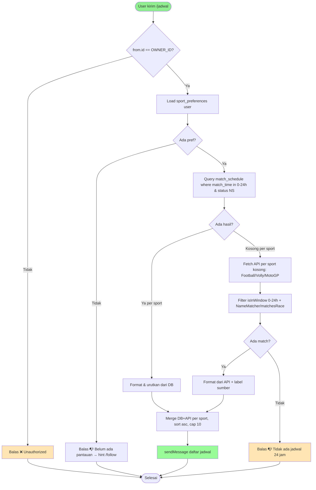
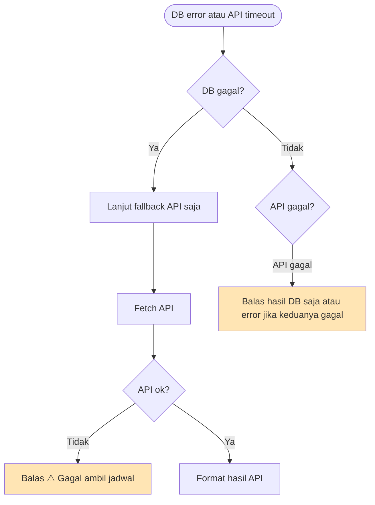

# Feature Specification: Cek Jadwal Pertandingan 1 Hari via Telegram Bot (DB-first, API fallback)

**Feature Branch**: `003-cek-jadwal-bot`  
**Created**: 2026-08-27  
**Status**: Draft  
**Input**: User description: "membuat command baru di telegram bot untuk mengecek jadwal pertandingan berikutnya dalam rentang waktu 1 hari. cek bisa hit langsung dari api jika pada table di database kosong"

## User Scenarios & Testing *(mandatory)*

### User Story 1 - Cek jadwal 1 hari via Telegram (Priority: P1)

User yang sudah follow tim/balapan kirim `/jadwal` (alias `/schedule`) di Telegram. Bot membalas daftar jadwal yang kickoff dalam 24 jam ke depan (0–24h dari sekarang) khusus untuk entitas yang ia follow. Sumber utama adalah `match_schedule` (hasil `bot:schedule` H-1 + `bot:notify`). Jika jadwal ada di DB, tampilkan langsung tanpa hit API eksternal.

**Why this priority**: Inti request — user mau tahu jadwal terdekat on-demand, bukan menunggu notifikasi H-1 jam. Tanpa ini fitur tidak ada.

**Independent Test**: Follow "Arsenal" (football). Ada row `match_schedule` untuk Arsenal dengan `match_time` dalam 12 jam. Kirim `/jadwal` sebagai owner → balasan berisi "Arsenal vs ..." dengan waktu WIB, tanpa call ke api-football.

**Acceptance Scenarios**:

1. **Given** user memfollow Arsenal yang main dalam 10 jam dan row ada di `match_schedule` (`status=NS`), **When** kirim `/jadwal`, **Then** bot balas daftar berisi match tersebut (home, away, kompetisi, jam WIB via `DisplayTime`)
2. **Given** user memfollow tim yang tidak main dalam 24 jam, **When** kirim `/jadwal`, **Then** bot balas "📭 Tidak ada jadwal dalam 24 jam ke depan." (tidak error)
3. **Given** pengirim bukan `OWNER_ID`, **When** kirim `/jadwal`, **Then** balas `❌ Unauthorized` dan tidak query DB/API (konsisten dengan `BotRouter` existing)
4. **Given** user belum follow apapun, **When** kirim `/jadwal`, **Then** balas "📭 Belum ada yang dipantau. Gunakan /follow ..." dengan hint

---

### User Story 2 - Fallback ke API jika DB kosong (Priority: P1)

Jika setelah filter `match_schedule` hasilnya kosong (belum pernah diisi `bot:schedule`, DB kosong, atau row di luar jendela 0–24h), bot hit API eksternal langsung untuk cek jadwal 1 hari. Tetap filter hanya untuk entitas yang difollow, lalu tampilkan. Tidak auto-insert ke `match_schedule` — hanya display on-demand (DB tetap sumber utama; API hanya fallback read).

**Why this priority**: Meng-cover cold-start & DB kosong sesuai request eksplisit: "cek bisa hit langsung dari api jika pada table di database kosong". Tanpa ini, user lihat kosong padahal ada jadwal di provider.

**Independent Test**: Kosongkan `match_schedule` (atau mock `SupabaseService::select` return []). Mock `FootballService::getUpcomingFixtures` return fixture Arsenal dalam 5 jam yang match pref. Kirim `/jadwal` → balasan tetap berisi fixture dari API, label sumber API.

**Acceptance Scenarios**:

1. **Given** `match_schedule` kosong untuk user dalam jendela 24h, **When** `/jadwal` dieksekusi, **Then** bot fetch `FootballService::getUpcomingFixtures` / `VolleyballService::getUpcomingGames` / `MotoGPService::getCurrentSeasonRaces`, filter `isInWindow(now, now+24h)` + `NameMatcher::matches`, dan balas hasilnya
2. **Given** DB kosong dan API juga tidak ada match yang difollow dalam 24h, **When** `/jadwal`, **Then** balas kosong yang sama seperti US1 scenario 2
3. **Given** DB kosong dan API key tidak dikonfigurasi / quota habis, **When** `/jadwal`, **Then** balas error ramah "⚠️ Gagal ambil jadwal dari API: ..." tanpa crash
4. **Given** DB ada sebagian (mis. football ada tapi volly kosong), **When** `/jadwal`, **Then** tampilkan yang dari DB; hanya sport yang kosong yang fallback ke API (per-sport fallback, tidak all-or-nothing)

---

### User Story 3 - Command terdaftar & discoverable (Priority: P2)

Command baru muncul di menu Telegram (daftar `/` di `BotRouter::MENU`) dan di `/help` / `/start`. Variasi `/jadwal`, `/schedule`, `/next` semua memicu handler sama untuk kemudahan.

**Why this priority**: Discoverability — tanpa entry di MENU dan help, user tidak tahu command ada.

**Independent Test**: Panggil `BotRouter::MENU` contains `jadwal`; `/help` text contains `/jadwal`; `bot:webhook` publish menu ke Telegram mencakup `jadwal`.

**Acceptance Scenarios**:

1. **Given** user kirim `/help`, **When** bot reply `WELCOME`, **Then** terdapat baris `"/jadwal — Cek jadwal 1 hari ke depan"`
2. **Given** `php artisan bot:webhook` dijalankan, **When** publish `setMyCommands`, **Then** daftar termasuk `jadwal`
3. **Given** user kirim `/jadwal` / `/schedule` / `/next`, **When** router handle, **Then** semua alias mengarah ke handler jadwal yang sama

---

### Edge Cases

- API timeout / 5xx → balas "⚠️ Gagal ambil jadwal ..." + log, jangan crash router; DB path tetap dicoba dulu
- `match_time` atau `date` tidak parseable → skip entry itu, lanjut entry lain
- Timezone: API return UTC (`2026-08-28T13:00:00+00:00`), DB `match_time` UTC, filter jendela `now` UTC, display convert ke `config('app.display_timezone')` (Asia/Jakarta) via `DisplayTime::format`
- Banyak match dalam 24h (mis. 5 fixture) → balas list terurut naik `match_time`, cap 10 entri untuk hindari pesan terlalu panjang (Telegram limit 4096 char)
- Duplikat `id` dari API today+tomorrow (api-football) → deduplicate `array_column(..., null, 'id')` seperti `FootballService`
- `SupabaseService::select` throw (table missing / 503) → fallback ke API tetap jalan; jika API juga gagal → error ramah
- MotoGP: `date+time` digabung (`2026-08-28T06:00:00`), `status != scheduled/NS` skip
- Command tanpa pref yang relevan untuk sport itu → sport tersebut skip tanpa hit API yang tidak perlu (hemat quota)

## Requirements *(mandatory)*

### Functional Requirements

- **FR-001**: System MUST menyediakan Telegram command `/jadwal` (alias `/schedule`, `/next`) yang membalas daftar jadwal pertandingan/balapan yang kickoff dalam 0–24 jam ke depan, filtered untuk `sport_preferences` user pengirim yang `notification_enabled` (via `SportPrefsService`)
- **FR-002**: System MUST cek `match_schedule` terlebih dahulu sebagai sumber utama: `select` dengan `match_time` dalam jendela `[now, now+24h]`, `status = NS` (atau `scheduled` untuk motogp), filter per `sport_type` yang dimiliki user
- **FR-003**: System MUST jika hasil DB kosong (atau select error), fallback hit API langsung per sport yang relevan: `FootballService::getUpcomingFixtures`, `VolleyballService::getUpcomingGames`, `MotoGPService::getCurrentSeasonRaces`; filter `MatchHelper::isInWindow(iso, now, now+24h)` dan matching via `NameMatcher::matches` (football/volly) / `MotoGPService::matchesRace` (motogp)
- **FR-004**: System MUST fallback bersifat per-sport, bukan global — sport yang sudah ada hasil di DB tidak perlu hit API untuk sport itu
- **FR-005**: System MUST menampilkan waktu dalam WIB (`DisplayTime::format`) dan mengurutkan hasil ascending `match_time`/`date`
- **FR-006**: System MUST mendaftarkan command di `BotRouter::MENU` (`jadwal => deskripsi`) dan di `WELCOME` help text; `RegisterWebhook` (`bot:webhook`) harus publish menu yang mencakup `jadwal` ke Telegram `setMyCommands`
- **FR-007**: System MUST reuse helper jendela waktu terpusat (`MatchHelper::isInWindow` atau konstanta baru `NEXT_24H`) — tidak duplikat logika parsing `DateTimeImmutable` per handler
- **FR-008**: System MUST membatasi balasan ke maksimal 10 jadwal terdekat; jika lebih, tambahkan baris "… dan N jadwal lainnya"
- **FR-009**: System MUST menangani unauthorized: jika `from.id != OWNER_ID`, balas unauthorized dan hentikan tanpa query DB/API (konsisten dengan `BotRouter::handle` existing)
- **FR-010**: System MUST tidak menulis ke `match_schedule` pada path `/jadwal` (read-only on-demand); insert tetap tanggung jawab `bot:schedule` / `bot:notify`
- **FR-011**: System MUST reuse `cache` yang ada di `FootballService` (3h TTL) sehingga hit API via `/jadwal` tidak menambah quota melebihi batas free-plan (100 req/day)

### Non-Functional Requirements

- **NFR-001**: Balasan `/jadwal` selesai dalam <3 detik pada kondisi normal (DB hit) dan <5 detik saat fallback API (termasuk 15s HTTP timeout)
- **NFR-002**: Tidak ada penambahan dependency baru; reuse `SupabaseService`, `FootballService`, `VolleyballService`, `MotoGPService`, `SportPrefsService`, `MatchHelper`, `DisplayTime`, `TelegramService`
- **NFR-003**: Outbound HTTP tetap pakai timeout 15s (existing `SupabaseService::TIMEOUT` dan `FootballService`); tidak ada call tanpa timeout
- **NFR-004**: Bot tetap jawab 200 ke Telegram webhook bahkan saat error internal (fallback error message, bukan exception propagate)

### Key Entities *(include if feature involves data)*

- **Telegram Update**: Pesan masuk dari Telegram webhook/polling
  - Key attributes: `from.id`, `chat.id`, `text` (command)
  - Owns / contains: command args (tidak ada untuk /jadwal)
  - State lifecycle: received → authorized? → routed → replied
  - Relationships: drives lookup ke `sport_preferences` + `match_schedule` / API

- **match_schedule**: Jadwal mendatang per-user (existing table, read-only untuk fitur ini)
  - Key attributes: `source_id` (`apiId:uUserId`), `sport_type`, `competition`, `home_team`, `away_team`, `match_time` (timestamptz UTC), `status` (NS/FT/scheduled), `notified`
  - Owns / contains: —
  - State lifecycle: NS/notified false (H-1 tersimpan) → NS/notified true (notified H-1 jam) → FT (reported) — tidak diubah oleh `/jadwal`
  - Relationships: difilter oleh `sport_preferences` via matching; dibaca oleh `SupabaseService::select`

- **sport_preferences**: Preferensi follow per user (existing)
  - Key attributes: `user_id`, `sport_type`, `entity_name`, `notification_enabled`
  - Relationships: determines which fixtures ditampilkan oleh `/jadwal`

- **External Fixture/Race**: Data dari provider (api-football, volleyball, Jolpica MotoGP) — transient, tidak dipersist oleh `/jadwal`
  - Key attributes: `id`/`round+session`, `date`+`time`, `home`/`away`/`league` atau `raceName`/`circuitName`/`locality`
  - State lifecycle: NS/scheduled → FT (diabaikan)
  - Relationships: matched via `NameMatcher`/`matchesRace` ke `sport_preferences`

## Success Criteria *(mandatory)*

### Measurable Outcomes

- **SC-001**: User kirim `/jadwal` dan menerima balasan berisi jadwal follow-nya dalam 24 jam dalam waktu <3 detik (DB path) — verifikasi manual di Telegram + log
- **SC-002**: Ketika `match_schedule` kosong, `/jadwal` tetap menampilkan jadwal yang ada di API (fallback) — verifikasi dengan mengosongkan `match_schedule` dan mock API fixture dalam 12 jam
- **SC-003**: `/help` dan menu Telegram `/` menampilkan `/jadwal` — verifikasi visual di Telegram client
- **SC-004**: Tidak ada regresi pada `composer test` dan `php artisan schedule:list` — semua test hijau
- **SC-005**: 100% jadwal yang ditampilkan adalah untuk entitas yang difollow user pengirim (tidak bocor tim lain) — verifikasi dengan 2 prefs dan fixture 5 tim, hanya yang match pref tampil

## UI/UX & Screens *(mandatory when the feature has a user interface)*

### Design Reference

- **Design source**: none — follow existing bot style (plain Telegram markdown, emoji prefix `⚽`/`🏐`/`🏍️` konsisten dengan `MatchNotifier`)
- **Look & feel / brand**: Emerald Nocturne tidak relevan (backend/bot); bot pakai Markdown parse_mode, emoji, dan `DisplayTime` WIB
- **Existing UI to match**: Balasan `MatchNotifier` (`"1 jam lagi!"`) dan `myteams` list di `BotRouter`

### Screen Inventory

| Screen | Purpose | Serves story | Key data shown | Primary actions |
| ------ | ------- | ------------ | -------------- | --------------- |
| Telegram chat (command `/jadwal`) | Cek jadwal 1 hari on-demand | US1, US2 | daftar `home vs away • competition • ⏱️ WIB` per sport, label sumber jika fallback | `/jadwal`, `/schedule`, `/next` |
| Telegram menu `/` | Discoverability command | US3 | list `jadwal — Cek jadwal 1 hari ke depan` | tap command |

### Per-Screen Key States

- **Telegram chat `/jadwal`**: loading = tidak ada (sync reply); empty = "📭 Tidak ada jadwal dalam 24 jam ke depan."; error = "⚠️ Gagal ambil jadwal ..." + hint `/myteams`/`/follow`; populated = header "📅 *Jadwal 24 jam ke depan*" + list terurut ascending (max 10) + optional "… dan N lainnya", tiap baris `emoji sport • home vs away • competition • ⏱️ DisplayTime`.

### Primary Interactions & Flows

- User kirim `/jadwal` → BotRouter `handle()` → `handleJadwal(uid, cid)` → load prefs via `SportPrefsService` → query `match_schedule` jendela 24h → jika kosong per sport → fetch API → filter & format → `sendMessage(cid, formatted)`
- Alias `/schedule` dan `/next` routing ke handler sama (string equals atau startsWith)
- Menu `/` dan `/help` menampilkan `/jadwal`

## Business Process Flow *(visual aid)*

### Primary User Journey Flow

### Alternative/Secondary Flows

## Business Actors & Interactions

| Actor | Role | Key Interactions |
| ----- | ---- | ---------------- |
| Owner (Telegram user `OWNER_ID`) | Single human yang follow tim | Kirim `/jadwal`/`/schedule`/`/next`, lihat jadwal 24h, follow/unfollow via `/follow` |
| BotRouter | System router | Authorize, route command, orchestrate DB-first then API fallback |
| Supabase `match_schedule` | Store | Sumber utama jadwal H-1 (read-only untuk /jadwal) |
| SportPrefsService | Store | Sumber pref filter |
| Football/Volleyball/MotoGP API | Provider | Sumber fallback jika DB kosong |
| Telegram Bot API | Channel | Terima update, kirim Markdown reply |

## Assumptions

- Rentang "1 hari" diartikan sebagai **0–24 jam ke depan dari `now` UTC** (bukan H-1 20–30h yang dipakai scheduler). Jika dimaksud 1×24 jam kalender (00:00–23:59 WIB hari ini), filter mudah diganti ke `startOfDay/endOfDay WIB`.
- Command utama `/jadwal`, alias `/schedule` dan `/next` diterima — konsisten dengan naming Indonesia di codebase (`/myteams` tetap Inggris).
- Fallback API bersifat read-only display; tidak auto-insert ke `match_schedule` agar tidak mengotori lifecycle `notified` dan menghindari write race dengan `bot:schedule`.
- Jika spec ini disetujui, per-sport fallback lebih hemat quota daripada global all-or-nothing.

