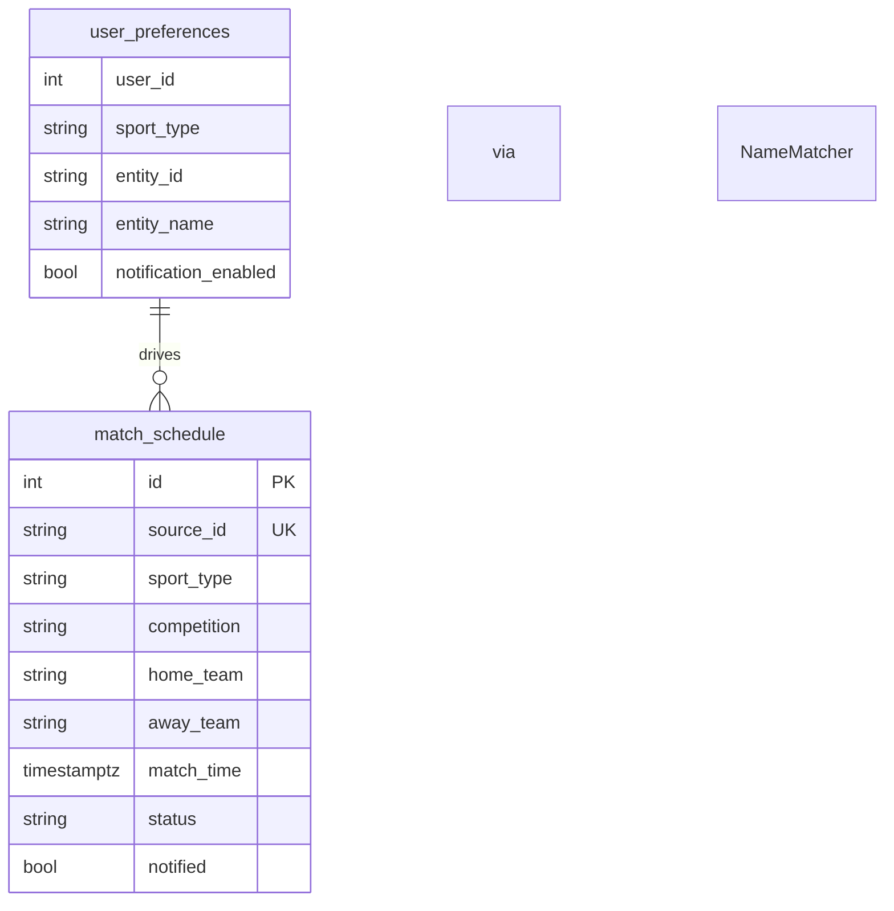
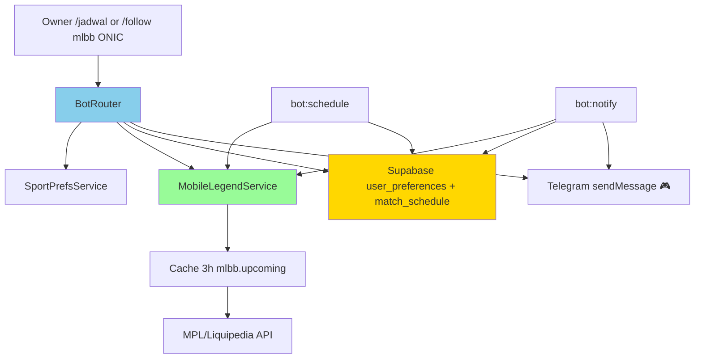
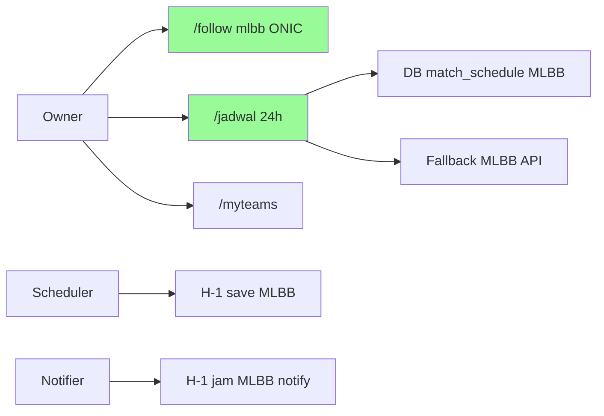
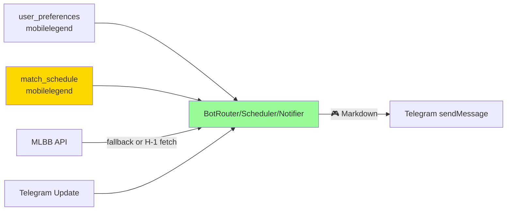
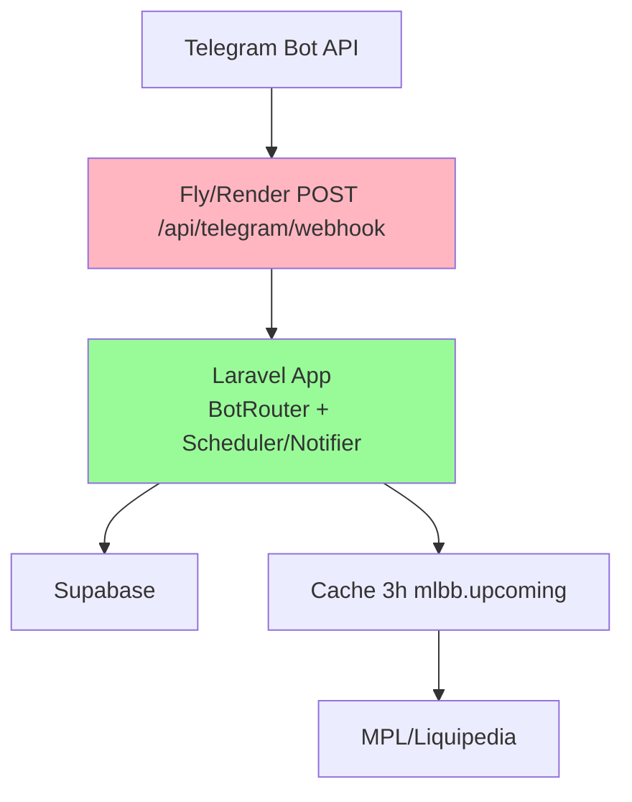

# Implementation Plan: Jadwal Mobile Legends (MPL ID) 24 Jam di Telegram

**Branch**: `004-mlbb-jadwal` | **Date**: 2026-08-27 | **Spec**: `specs/004-mlbb-jadwal/spec.md`
**Input**: Feature specification from `specs/004-mlbb-jadwal/spec.md`

## Summary

Buat `MobileLegendService` + extend `SPORTS` dengan `mobilelegend` (alias `mlbb`/`ml`) sehingga `/follow mobilelegend` tervalidasi, `/jadwal` DB-first 0–24h tampilkan MLBB 🎮 per-sport fallback, dan `bot:schedule`/`bot:notify` simpan & notif H-1/H-1 jam. Tanpa table baru, reuse `user_preferences` + `match_schedule` via `SupabaseService`, `MatchHelper`, `DisplayTime`, cache 3h, timeout 15s.

## Technical Context

**Language/Version**: PHP 8.3, Laravel 13  
**Primary Dependencies**: BotRouter, SportPrefsService, SupabaseService, MobileLegendService (new), FootballService, VolleyballService, MotoGPService, NameMatcher, MatchHelper, DisplayTime, TelegramService  
**Storage**: Supabase Postgres `user_preferences` + `match_schedule` (REST, no new table); Cache `mlbb.upcoming` 3h + `mlbb.teams.*` 1d  
**Testing**: PHPUnit 12, SQLite in-memory (framework only) — Http::fake for Supabase + provider, Mockery for TelegramService  
**Target Platform**: Laravel BotRouter (webhook prod `POST /api/telegram/webhook` + polling `bot:listen` dev)  
**Project Type**: Web app monolith (Laravel+Vue SPA + Telegram bot)  
**Architecture Type**: Monolith — single Laravel app serving SPA catch-all + API + Console Commands  
**Integration Target**: Telegram `sendMessage`/`setMyCommands`, Supabase REST, MPL/Liquipedia esports API (provisional), api-football/Jolpicaexisting unchanged  
**Existing Design System**: Bot-only — Telegram Markdown + emoji distinct (`🎮` MLBB vs `⚽`/`🏐`/`🏍️`), dashboard Emerald Nocturne tidak tersentuh  
**Performance Goals**: `/jadwal` MLBB fallback <5s, schedule/notify each sport <5s per run  
**Constraints**: HTTP 15s timeout; webhook must answer 200 even on MLBB error; cache 3h respect quota; single-owner `OWNER_ID`; alias normalisasi ke `mobilelegend`  
**Scale/Scope**: 1 user OWNER_ID, multi-user ready via `source_id:uUID`; ~5–20 MLBB fixtures/week (MPL season)

## UI/UX & Screens (carried from spec)

- **Design reference**: none — follow existing bot Markdown (`🎮` distinct)
- **Screens**:
  - `/follow mobilelegend` → validation via `searchTeams`, suggestion, persist `mobilelegend`
  - `/jadwal` → mixed sport rows including `🎮 home vs away — league — ⏱️ WIB` sorted asc cap10
  - `/myteams` → includes `mobilelegend` rows with 🔔
  - Notif H-1 jam `🎮 1 jam lagi!` via `bot:notify`
- **Primary flows**: Follow alias `mlbb/ml` → `resolveEntity` MLBB → `/jadwal` DB per-sport MLBB → fallback API → scheduler H-1 insert → notifier H-1 send

## Constitution Check

*GATE: Must pass before Phase 0 research. Re-check after Phase 1 design.*

- [x] I. External Data Only — MLBB prefs/schedule via `SupabaseService`, fixtures transient via `MobileLegendService` HTTP, no local Eloquent app table
- [x] II. Single-Owner Scope — `from.id != OWNER_ID` → unauthorized, MLBB same whitelist
- [x] III. Tests Ship With Changes — `tests/Feature/BotRouterMlbbTest.php`, `tests/Unit/MobileLegendServiceTest.php`, `tests/Feature/MatchSchedulerMlbbTest.php`
- [x] IV. One Handler Path — BotRouter + MatchScheduler/Notifier share `MobileLegendService` + `NameMatcher` + `MatchHelper`; no duplicated HTTP
- [x] V. Timezone Discipline — MLBB `date` normalized to UTC ISO, filter UTC `isNext24Hours`/`isOneDayAway`, display WIB `DisplayTime`
- [x] VI. Simplicity Over Speculation — reuse `MatchHelper`, one service, one SPORTS entry + aliases, cache 3h existing pattern, no new queue
- Gate: PASS

## Project Structure

### Documentation (this feature)

```text
specs/004-mlbb-jadwal/
├── spec.md
├── plan.md              # This file
├── research.md          # Phase 0 output
├── data-model.md        # Phase 1 output
├── quickstart.md        # Phase 1 output
├── contracts/           # Phase 1 output (telegram mlbb)
└── tasks.md             # Phase 2 output (NOT created by /pandawa.plan)
```

### Source Code (repository root)

```text
app/
├── Services/
│   ├── SportPrefsService.php       # MOD: add mobilelegend to SPORTS + alias normalization
│   ├── BotRouter.php               # MOD: resolveEntity MLBB + handleJadwal MLBB fallback + formatJadwalRow 🎮
│   ├── MobileLegendService.php     # NEW: getUpcomingMatches, searchTeams, getResult? (ponytail stub)
│   ├── DisplayTime.php             # reuse
│   ├── NameMatcher.php             # reuse
│   └── SupabaseService.php         # reuse
├── Support/
│   └── MatchHelper.php             # reuse isNext24Hours/isOneDayAway
└── Console/Commands/
    ├── MatchScheduler.php          # MOD: add mlbb H-1 schedule branch
    └── MatchNotifier.php           # MOD: add mlbb notify branch

tests/
├── Feature/BotRouterMlbbTest.php   # NEW
├── Feature/MatchSchedulerMlbbTest.php # NEW (or extend MatchSchedulerTest)
└── Unit/MobileLegendServiceTest.php # NEW
```

**Structure Decision**: Monolith Laravel — tambah 1 service baru `MobileLegendService` (mirror `FootballService` shape: `getUpcomingMatches()->[{id,date,home,away,league}]`, `searchTeams`), normalisasi alias `mlbb/ml`→`mobilelegend` di `SportPrefsService` helper, extend 3 existing handlers (BotRouter, Scheduler, Notifier) dengan cabang MLBB per-sport isolation.

## Complexity Tracking

| Violation | Why Needed | Simpler Alternative Rejected Because |
| --------- | ---------- | ------------------------------------ |
| none | — | — |

---

## Technical Diagrams

### Data Design Decisions

| Source resource / sub-resource | Table(s) | Mapping | Rationale |
| ------------------------------ | -------- | ------- | --------- |
| `user_preferences` MLBB follow | `user_preferences` | mirror — `sport_type=mobilelegend` | reuse existing prefs table |
| `match_schedule` MLBB per-user | `match_schedule` | mirror — `source_id:uUID`, `sport_type=mobilelegend`, `competition/home/away/match_time/status/notified` | reuse existing schedule table |
| MLBB fixture `{id,date,home,away,league,status}` | transient API | no table — in-memory filtered `isNext24Hours`/`isOneDayAway` | fallback read-only, not persisted except via scheduler |
| MPL season/tournament | derived from fixture `league` | no table | season encoded in league string |

No new table. `match_schedule` shape same as `003-cek-jadwal-bot:93`.

### Data Model (Entity Relationship Diagram)



### System Architecture



### Use Case Diagram



### Data Flow Diagram (Level 0)



### API Contract Overview

No dashboard HTTP API change. Bot/CLI contracts:

| Operation | Trigger | Method | Purpose |
| --------- | ------- | ------ | ------- |
| Follow MLBB | `/follow mobilelegend|mlbb|ml <team>` | Telegram message | persist pref, validation via searchTeams |
| Jadwal MLBB | `/jadwal` (existing) | Telegram message | reply MLBB 🎮 0–24h DB-first per-sport |
| List | `/myteams` | Telegram message | includes mobilelegend rows |
| Schedule H-1 | `bot:schedule` | CLI hourly | insert MLBB H-1 20–30h |
| Notify H-1 | `bot:notify` | CLI every15m | send MLBB 1h, update notified |

### Deployment Architecture



## Decisions

- **Alias → canonical**: `mlbb`/`ml`/`mobilelegend` all lowercased → canonical `mobilelegend` before `SportPrefsService` call; `SPORTS` contains only `mobilelegend`, router normalizes. Keeps `sport_type` unique and dedup via `source_id:uUID`.
- **Provider provisional**: Liquipedia MPL ID parse or unofficial MPL API — same interface `{id,date,home,away,league}` as football. Service throws if `services.mpl.api_key` empty and endpoint requires it → catch returns `[]` (empty fallback). Lock provider in research phase; interface stable regardless.
- **Reuse NameMatcher**: MLBB team names like `ONIC`, `EVOS` — partial match via existing matcher sufficient; no new matcher.
- **Scheduler dedup**: MLBB `source_id = "mlbb-{id}:u{uid}"` or raw id if provider numeric — consistent with football `55:u7`. `select` check per `source_id+sport_type`.
- **Emoji 🎮** distinct — avoids clash with 🎮? Keep distinct from ⚽🏐🏍️; used in `formatJadwalRow` and notifier.
- **No result reporting for MLBB** initially — `reportResults` ponytail skips non football/volly; add `MobileLegendService::getResult` when score endpoint known.
