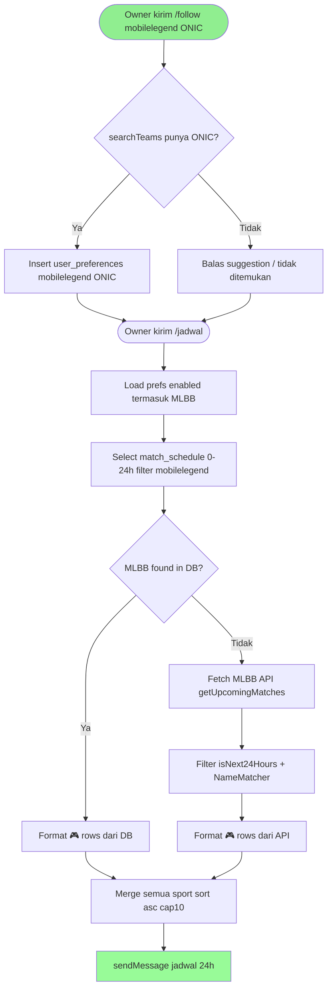
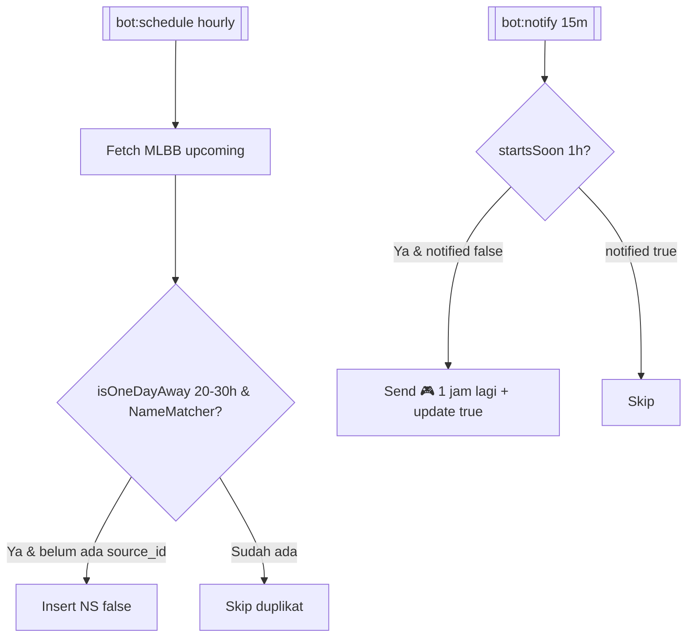

# Feature Specification: Jadwal Mobile Legends (MPL ID) 24 Jam di Telegram

**Feature Branch**: `004-mlbb-jadwal`  
**Created**: 2026-08-27  
**Status**: Draft  
**Input**: User description: "Menambahkan Mobile Legends Bang Bang (MPL ID) ke jadwal pertandingan: extend sport_preferences dan command /jadwal Telegram agar bisa follow tim MLBB, tampil di jadwal 1 hari DB-first per-sport fallback, integrasi dengan MatchHelper, DisplayTime, dan MatchScheduler/Notifier. Sumber jadwal provisionally via Liquipedia / MPL esports API, cache 3 jam, tanpa table lokal baru."

## User Scenarios & Testing *(mandatory)*

### User Story 1 - Follow tim MLBB dan cek validasi (Priority: P1)

Owner kirim `/follow mobilelegend ONIC` (alias `mlbb`). Bot validasi nama tim via pencarian provider MLBB; jika persis ada simpan `sport_type=mobilelegend` ke `user_preferences`, jika tidak balas suggestion mirip (seperti football/volly). `/unfollow mobilelegend ONIC` hapus, `/myteams` tampilkan entri MLBB dengan 🔔.

**Why this priority**: Pintu masuk data — tanpa follow yang tervalidasi, `/jadwal` tidak punya filter dan notifikasi tidak pernah match.

**Independent Test**: Mock provider MLBB return `[ONIC, EVOS, RRQ]`. Kirim `/follow mobilelegend ONIC` → balas `✅ Memantau ONIC di mobilelegend` dan row `user_preferences` ada. Kirim `/follow mobilelegend Xyz` → balas `⚠️ Tim Xyz tidak ditemukan`.

**Acceptance Scenarios**:

1. **Given** input `/follow mobilelegend ONIC` dan provider punya ONIC, **When** handler jalan, **Then** insert `user_preferences` dengan `sport_type=mobilelegend`, `entity_id=onic`, `entity_name=ONIC`
2. **Given** input `/follow mlbb EVOS` (alias), **When** handler jalan, **Then** diperlakukan sama sebagai `mobilelegend`
3. **Given** provider tidak punya tim yang diminta, **When** follow, **Then** balas suggestion max 6 nama mirip atau `tidak ditemukan`, tidak insert
4. **Given** sport di luar dukung (`/follow pubg ...`), **When** handler jalan, **Then** balas `Sport pubg belum didukung. Pilihan: football, volly, motogp..., mobilelegend`

---

### User Story 2 - /jadwal tampilkan MLBB 24 jam DB-first + fallback API (Priority: P1)

Owner kirim `/jadwal` (alias `/schedule`, `/next`) — flow existing DB-first 0–24h tetap: untuk `mobilelegend`, baca `match_schedule` (`sport_type=mobilelegend`, `status NS/scheduled`, `source_id:uUID`, `match_time` dalam `isNext24Hours`) dulu; jika kosong per-sport, fallback hit `MobileLegendService::getUpcomingMatches()` filter `isNext24Hours` + `NameMatcher::matches(team)`.

**Why this priority**: Inti request user — "mobile legend tidak ada pada jadwal?" — jadikan MLBB setara football/volly di `/jadwal`.

**Independent Test**: Pref MLBB ONIC ada. Mock `match_schedule` kosong untuk MLBB. Mock `MobileLegendService` return match `ONIC vs EVOS` +6h. Kirim `/jadwal` → balas berisi baris `🎮 ONIC vs EVOS — MPL ID S15 — ⏱️ WIB`.

**Acceptance Scenarios**:

1. **Given** ada row `match_schedule` MLBB ONIC vs EVOS `match_time` +5h, **When** `/jadwal`, **Then** tampil dari DB (tidak hit API MLBB)
2. **Given** DB MLBB kosong tapi API MLBB punya ONIC vs RRQ +6h, **When** `/jadwal`, **Then** tampil dari API fallback (per-sport; football/volly yang sudah ada DB tidak ke-hit API lagi)
3. **Given** API MLBB juga kosong / di luar 24h, **When** `/jadwal`, **Then** balas `📭 Tidak ada jadwal dalam 24 jam` (tidak error)
4. **Given** pref MLBB nonaktif (`notification_enabled=false`), **When** `/jadwal`, **Then** MLBB diabaikan (tidak query DB/API untuk sport itu)

---

### User Story 3 - Scheduler & notifier simpan/kirim MLBB H-1 (Priority: P2)

Sama lifecycle football/volly: `bot:schedule` simpan H-1 (20–30h) `match_schedule` `notified=false`; `bot:notify` kirim 1 jam (`isNext24Hours`/`startsSoon` untuk MLBB window 1h) update `notified=true`, `reportResults` opsional (skip jika API MLBB tidak punya final score). Dashboard/ICS otomatis lihat row MLBB.

**Why this priority**: Tanpa scheduler, `/jadwal` bergantung penuh fallback API; dengan scheduler jadwal muncul H-1 seperti sport lain.

**Independent Test**: Mock MLBB upcoming +25h ONIC vs EVOS. Jalankan `bot:schedule` → insert `match_schedule` MLBB `notified=false`. Mock +30m kickoff, jalankan `bot:notify` → Telegram terkirim `🎮 1 jam lagi!` dan row `notified=true`.

**Acceptance Scenarios**:

1. **Given** MLBB fixture +25h difollow, **When** `bot:schedule` jalan, **Then** insert `source_id=mlbbId:uUID` `sport_type=mobilelegend`
2. **Given** sudah ada `source_id` itu, **When** schedule jalan lagi, **Then** skip duplikat
3. **Given** fixture +30m, **When** `bot:notify` jalan dan row `notified=false`, **Then** kirim notif dan update `notified=true`; jika sudah `true` skip

---

### Edge Cases

- Provider MLBB timeout/5xx / key kosong → balas `⚠️ Gagal ambil jadwal ...` tanpa crash; DB path tetap dicoba dulu; fallback catch per-sport
- Team name matching pakai `NameMatcher::matches` (partial, case-insensitive, normalized) — konsisten football/volly, tidak exact string
- Alias sport: `mobilelegend`, `mlbb`, `ml` semua map ke `mobilelegend` (normalisasi di `SportPrefsService::SPORTS` + router)
- Timezone: provider return UTC atau WIB → normalisasi ke ISO UTC di service, `DisplayTime::format` tampil WIB (`Asia/Jakarta`)
- Duplikat id dari provider (today+tomorrow list) → dedup `array_column(..., null, 'id')` seperti FootballService
- Cap 10 di `/jadwal` tetap — jika >10 MLBB + football campur, slice asc dan `… dan N lainnya`
- Rate limit: cache provider 3h (`mlbb.upcoming`) serupa `football.upcoming`; HTTP timeout 15s
- Status provider non `NS`/`scheduled` (live/finished/cancel) → skip

## Requirements *(mandatory)*

### Functional Requirements

- **FR-001**: System MUST menerima `sport_type=mobilelegend` sebagai anggota `SportPrefsService::SPORTS` dengan alias `mlbb` dan `ml` (normalisasi ke `mobilelegend` sebelum persist)
- **FR-002**: System MUST validasi `follow mobilelegend <team>` via `MobileLegendService::searchTeams(query)` (cache 1d) — exact match simpan, jika tidak balas suggestion seperti flow football
- **FR-003**: System MUST simpan/hapus/list pref MLBB via `SportPrefsService` sama dengan sport lain (`myteams` tampil `mobilelegend` dengan 🔔/🔕)
- **FR-004**: System MUST tampilkan MLBB di `BotRouter::handleJadwal` dengan prioritas DB-first: filter `match_schedule` `sport_type=mobilelegend`, `status NS/scheduled`, `source_id:uUID`, `isNext24Hours` — tanpa `NameMatcher` ulang untuk DB (DB sudah per-user filtered)
- **FR-005**: System MUST fallback per-sport MLBB: jika DB kosong untuk `mobilelegend`, hit `MobileLegendService::getUpcomingMatches()` (cache 3h), filter `isNext24Hours` + `NameMatcher::matches(team, entity_name)` per pref, merge, sort asc
- **FR-006**: System MUST format baris MLBB `🎮 {home} vs {away} — {league/tournament} — ⏱️ {DisplayTime WIB}` di `formatJadwalRow` dan fallback formatter, konsisten emoji distinct
- **FR-007**: System MUST tambah cabang MLBB di `MatchScheduler::handle` (H-1 20–30h via `MatchHelper::isOneDayAway`) insert `match_schedule` `notified=false` dan `MatchNotifier::notify` (1h via `startsSoon`/`isNext24Hours`) send + update `notified=true` — reuse `sourceId` pattern `id:uUID`
- **FR-008**: System MUST reuse `MatchHelper::isNext24Hours` / `isOneDayAway` / `isInWindow` — tidak duplikat parsing `DateTimeImmutable`
- **FR-009**: System MUST menangani provider error/timeout dengan per-sport try/catch tanpa crash router/scheduler (webhook tetap 200)
- **FR-010**: System MUST tidak menambah table lokal baru — tetap `user_preferences` + `match_schedule` via `SupabaseService` (External Data Only)
- **FR-011**: System MUST reuse alias route `/jadwal|/schedule|/next` yang sudah ada — MLBB otomatis tercakup tanpa command baru

### Non-Functional Requirements

- **NFR-001**: Balasan `/jadwal` dengan MLBB tetap <5s saat fallback API (HTTP 15s timeout, cache hit <3s)
- **NFR-002**: Tidak tambah dependency baru selain HTTP client existing; cache pattern sama `football.upcoming` (TTL 3h search 1d)
- **NFR-003**: Outbound HTTP MLBB pakai timeout 15s, header `apikey`/`x-api-key` via `config/services.php` (secret tidak log)
- **NFR-004**: `composer test` dan `./vendor/bin/pint` hijau; style sama notifier/scheduler

### Key Entities *(include if feature involves data)*

- **user_preferences**: Follow per user
  - Key attributes: `user_id`, `sport_type=mobilelegend`, `entity_id` (slug lower), `entity_name` (canonical), `notification_enabled`
  - Relationships: drives filter `match_schedule` & API fallback

- **match_schedule**: Jadwal MLBB per-user
  - Key attributes: `source_id` (`mlbbId:uUID`), `sport_type=mobilelegend`, `competition` (MPL ID S15), `home_team`, `away_team`, `match_time` UTC, `status` NS/scheduled/FT, `notified`
  - State lifecycle: `NS/false (H-1 scheduled)` → `NS/true (notified 1h)` → `FT` (reported, opsional MLBB)
  - Relationships: matches `user_preferences` via `NameMatcher`

- **MLBB Fixture (transient provider)**: `{id, date (ISO UTC), home, away, league/tournament, status}`
  - Owns: —
  - State lifecycle: `NS/scheduled` → `live`/`FT`/`canceled` (hanya `NS` dipakai scheduler/jadwal)
  - Relationships: matched via `NameMatcher`

- **Telegram Update**: sama seperti existing — `from.id` auth `OWNER_ID`, `chat.id`, `text` (`/follow`, `/jadwal`)

## Success Criteria *(mandatory)*

### Measurable Outcomes

- **SC-001**: Owner follow `ONIC` via `/follow mobilelegend ONIC` berhasil dan muncul di `/myteams` sebagai `mobilelegend` dalam 1 interaksi
- **SC-002**: `/jadwal` menampilkan MLBB yang kickoff 0–24h dari DB jika ada, fallback API jika DB kosong — verifikasi dengan mock DB kosong + mock API +5h
- **SC-003**: `bot:schedule` menyimpan MLBB H-1 sekali saja (idempotent `source_id`) dan `bot:notify` mengirim tepat H-1 jam (update `notified`)
- **SC-004**: Tidak ada regresi: `composer test` hijau, `pint` hijau, football/volly/motogp/jadwal tetap jalan (per-sport isolation terbukti)
- **SC-005**: Menu `/` dan `/help` tetap konsisten; MLBB tidak perlu command baru — discoverable via `/follow` hint `mobilelegend/mlbb` di error sport

## UI/UX & Screens *(mandatory when the feature has a user interface)*

### Design Reference

- **Design source**: none — follow existing bot Markdown + emoji distinct (`🎮` untuk MLBB beda dari `⚽`/`🏐`/`🏍️`)
- **Look & feel / brand**: Telegram Markdown, WIB via `DisplayTime`, emoji 1 per sport
- **Existing UI to match**: `BotRouter::MENU`, `WELCOME`, `myteams` list, `MatchNotifier` baris notifikasi

### Screen Inventory

| Screen | Purpose | Serves story | Key data shown | Primary actions |
| ------ | ------- | ------------ | -------------- | --------------- |
| Telegram chat `/follow mobilelegend` | Follow tim MLBB | US1 | suggestion/persisted name | `/follow mobilelegend ONIC`, `/follow mlbb EVOS` |
| Telegram chat `/jadwal` | Lihat MLBB + sport lain 24h | US2 | `🎮 home vs away — league — ⏱️ WIB` sorted asc, cap10 | `/jadwal`/`/schedule`/`/next` |
| Telegram `/myteams` | Daftar follow termasuk MLBB | US1 | `ONIC (mobilelegend) 🔔` per row | `/myteams` |
| Telegram notif H-1 jam | Alert MLBB 1 jam sebelum | US3 | `🎮 1 jam lagi! ONIC vs EVOS — MPL ID — ⏱️ WIB` | auto via `bot:notify` |
| Dashboard matches list | Lihat jadwal MLBB H-1 (existing) | US3 | same `match_schedule` rows | read |

### Per-Screen Key States

- **`/follow mobilelegend`**: loading none (sync); error sport unknown → `⚠️ Sport ... belum didukung. Pilihan: ...mobilelegend`; team not found → suggestion; success → `✅ Memantau ONIC di mobilelegend`
- **`/jadwal`**: empty `📭 Tidak ada jadwal...` (jika semua sport kosong termasuk MLBB); error provider → `⚠️ Gagal ambil jadwal: ...` tapi tetap coba DB; populated header `📅 *Jadwal 24 jam ke depan*` + mixed sport rows asc, MLBB pakai 🎮
- **`/myteams`**: empty `📭 Belum ada yang dipantau`; populated list termasuk `mobilelegend` rows
- **Notif H-1**: sent once per `source_id:uUID` (guard `notified`)

### Primary Interactions & Flows

- Follow: `/follow mlbb ONIC` → `resolveEntity` MLBB → `searchTeams` → exact? insert → reply; alias `mobilelegend`/`mlbb`/`ml` dinormalisasi
- Jadwal: `/jadwal` → `getPreferences(uid)` → filter enabled → DB `match_schedule` 0–24h per sport (termasuk MLBB) → hasDb? → fallback MLBB `getUpcomingMatches` + `isNext24Hours` + `NameMatcher` → `formatJadwalRow` 🎮 → sort+cap10 → `sendMessage`
- Scheduler: `bot:schedule` hourly → prefs MLBB → `getUpcomingMatches` → `isOneDayAway` 20–30h → `NameMatcher` → `sourceId` dedup → insert
- Notifier: `bot:notify` every15m → `startsSoon` 1h → match MLBB → send + update `notified`

## Business Process Flow *(visual aid)*

### Primary User Journey Flow

### Alternative/Secondary Flows

## Business Actors & Interactions

| Actor | Role | Key Interactions |
| ----- | ---- | ---------------- |
| Owner (`OWNER_ID`) | Single human | `/follow mobilelegend`, `/jadwal`, `/myteams`, terima notif H-1 MLBB |
| BotRouter | System router | auth, route MLBB follow/jadwal, format 🎮 |
| SportPrefsService | Store | persist `mobilelegend` prefs |
| Supabase `user_preferences`/`match_schedule` | Store (External) | sumber follow & jadwal per-user |
| MobileLegendService (baru) | Provider adapter | `searchTeams`, `getUpcomingMatches`, `getResult` opsional; cache 3h |
| MPL/Liquipedia esports API | External | sumber jadwal MLBB |
| Football/Volley/MotoGP services | Peers | tidak terpengaruh (per-sport isolation) |

## Assumptions

- Sumber MLBB provisional: Liquipedia API atau unofficial MPL esports API — pilih yang punya `date`, `home`, `away`, `league`, `status NS`; jika tidak ada key publik, fallback to scraping/cache manual tetap via same service interface.
- Rentang `mobilelegend` alias: `mobilelegend`, `mlbb`, `ml` → normalisasi ke `mobilelegend` sebelum persist/query; `SportPrefsService::SPORTS` tambah `mobilelegend` saja (alias hanya di router).
- Emoji MLBB `🎮` distinct dari sport lain untuk bedakan di `/jadwal` mixed.
- `isNext24Hours`/`isOneDayAway` reuse `MatchHelper`; tidak menambah window baru.
- Config key provisional `services.mpl.api_key` / `services.esports.key` — jika kosong, service throw dan handler catch jadi `fallback kosong` (tidak crash).
