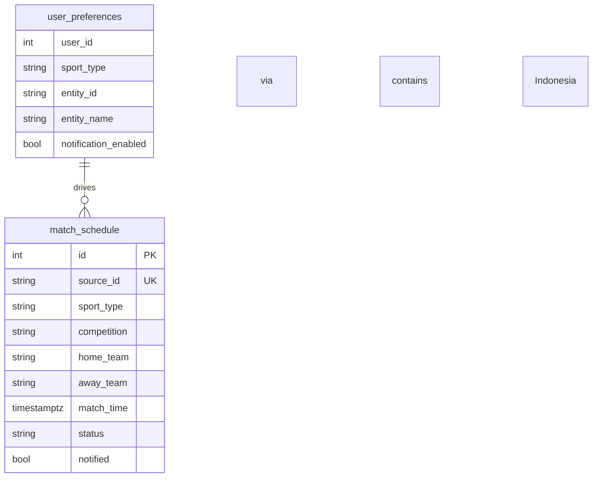
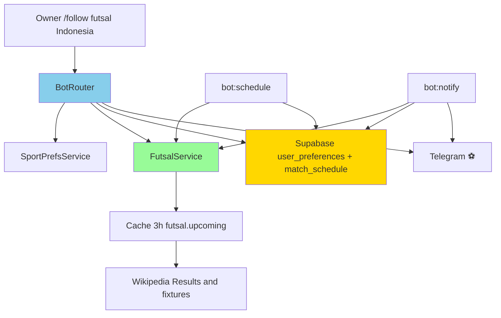
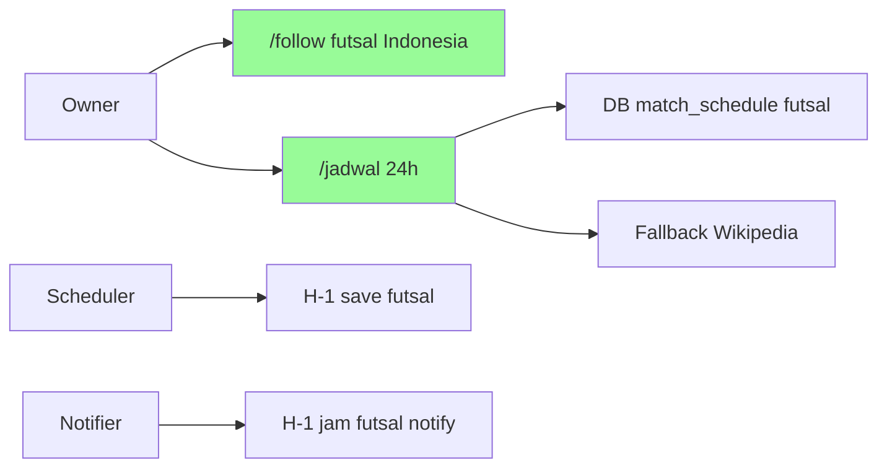
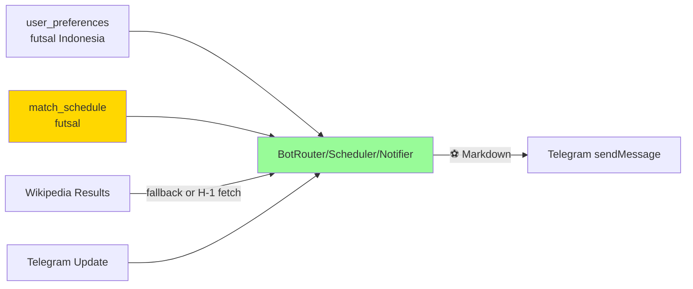
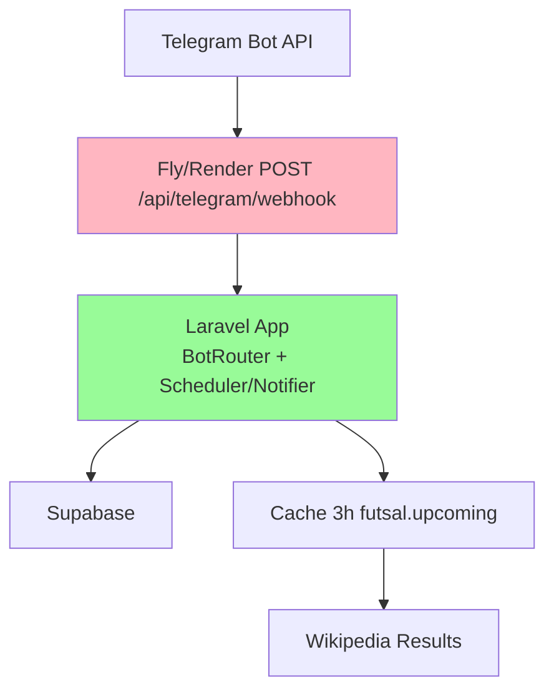

# Implementation Plan: Timnas Futsal Indonesia — Jadwal 24 Jam di Telegram

**Branch**: `005-timnas-futsal` | **Date**: 2026-08-27 | **Spec**: `specs/005-timnas-futsal/spec.md`
**Input**: Feature specification from `specs/005-timnas-futsal/spec.md`

## Summary

Tambah `sport_type=futsal` single team `Indonesia` (alias `timnas`/`garuda`) dengan `FutsalService` scrape Wikipedia `Indonesia_national_futsal_team` Results. Extend `SportPrefsService::SPORTS`, `BotRouter` follow validasi statis + `handleJadwal` DB-first 0–24h fallback `FutsalService`, `MatchScheduler` H-1 (20–30h) + `MatchNotifier` 1h, reuse `MatchHelper`/`DisplayTime`, cache 3h, tanpa table baru.

## Technical Context

**Language/Version**: PHP 8.3, Laravel 13  
**Primary Dependencies**: BotRouter, SportPrefsService, SupabaseService, FutsalService (new), NameMatcher (trivial), MatchHelper, DisplayTime, TelegramService  
**Storage**: Supabase Postgres `user_preferences` + `match_schedule` (REST, no new table); Cache `futsal.upcoming` 3h + `futsal.teams` 1d (static)  
**Testing**: PHPUnit 12, SQLite in-memory (framework only) — Http::fake Wikipedia HTML, Mockery Telegram  
**Target Platform**: Laravel BotRouter (webhook prod `POST /api/telegram/webhook` + polling `bot:listen`)  
**Project Type**: Web app monolith (Laravel+Vue SPA + Telegram bot)  
**Architecture Type**: Monolith — single Laravel app serving SPA catch-all + API + Console Commands  
**Integration Target**: Telegram `sendMessage`, Supabase REST, Wikipedia `en.wikipedia.org/wiki/Indonesia_national_futsal_team` (provisional)  
**Existing Design System**: Bot-only — Telegram Markdown + emoji `⚽` (futsal sama football, kompetisi beda), dashboard Emerald Nocturne tidak tersentuh  
**Performance Goals**: `/jadwal` futsal fallback <5s, schedule/notify each <5s  
**Constraints**: HTTP 15s timeout; webhook must answer 200 even on Wikipedia error; cache 3h; single-owner `OWNER_ID`; single team `Indonesia` ceiling  
**Scale/Scope**: 1 user OWNER_ID, ~5–10 timnas fixtures per 3 bulan (AFC/ASEAN/CFA)

## UI/UX & Screens (carried from spec)

- **Design reference**: none — follow existing bot Markdown (`⚽`)
- **Screens**:
  - `/follow futsal Indonesia|timnas|garuda` → validasi statis map ke `Indonesia`
  - `/jadwal` → `⚽ Indonesia vs Cambodia — CFA — ⏱️ WIB` sorted asc cap10 termasuk futsal
  - `/myteams` → includes `Indonesia (futsal) 🔔`
  - Notif H-1 `⚽ 1 jam lagi! Indonesia vs ...`
- **Primary flows**: Follow single team → `/jadwal` DB per-sport futsal → fallback Wikipedia scrape + `isNext24Hours` + contains Indonesia → scheduler H-1 insert → notifier H-1 send

## Constitution Check

*GATE: Must pass before Phase 0 research. Re-check after Phase 1 design.*

- [x] I. External Data Only — futsal prefs/schedule via `SupabaseService`, fixtures transient via `FutsalService` HTTP Wikipedia, no local table
- [x] II. Single-Owner Scope — `from.id != OWNER_ID` → unauthorized, futsal same whitelist
- [x] III. Tests Ship With Changes — `tests/Feature/BotRouterFutsalTest.php`, `tests/Unit/FutsalServiceTest.php`
- [x] IV. One Handler Path — BotRouter + Scheduler/Notifier share `FutsalService` + `MatchHelper`; no duplicated HTTP
- [x] V. Timezone Discipline — Wikipedia `13:30 UTC+8` / `18:30 UTC+7` → parse offset → UTC → `isNext24Hours`, display WIB `DisplayTime`
- [x] VI. Simplicity Over Speculation — static 1 team, 1 service, reuse helpers, cache 3h, no new queue
- Gate: PASS

## Project Structure

### Documentation (this feature)

```text
specs/005-timnas-futsal/
├── spec.md
├── plan.md              # This file
├── research.md          # Phase 0 output
├── data-model.md        # Phase 1 output
├── quickstart.md        # Phase 1 output
├── contracts/           # Phase 1 output
└── tasks.md             # Phase 2 output (NOT created by /pandawa.plan)
```

### Source Code (repository root)

```text
app/
├── Services/
│   ├── SportPrefsService.php       # MOD: add futsal + alias helper timnas/garuda → Indonesia
│   ├── BotRouter.php               # MOD: follow static validation + handleJadwal futsal fallback + format
│   ├── FutsalService.php           # NEW: getUpcomingMatches scrape Wikipedia
│   └── SupabaseService.php         # reuse
├── Support/
│   └── MatchHelper.php             # reuse isNext24Hours/isOneDayAway
└── Console/Commands/
    ├── MatchScheduler.php          # MOD: futsal H-1 branch
    └── MatchNotifier.php           # MOD: futsal notify branch
```

**Structure Decision**: Monolith Laravel — tambah 1 service `FutsalService` (scrape `Results and fixtures` → `{id,date,home,away,league}`), `SPORTS+=futsal`, BotRouter static validation single team, extend 3 handlers per-sport isolation.

## Complexity Tracking

| Violation | Why Needed | Simpler Alternative Rejected Because |
| --------- | ---------- | ------------------------------------ |
| none | — | — |

---

## Technical Diagrams

### Data Design Decisions

| Source resource / sub-resource | Table(s) | Mapping | Rationale |
| ------------------------------ | -------- | ------- | --------- |
| `user_preferences` futsal | `user_preferences` | mirror — `sport_type=futsal`, `entity_id=indonesia`, `entity_name=Indonesia` | reuse prefs, single row |
| `match_schedule` futsal | `match_schedule` | mirror — `source_id:uUID`, `sport_type=futsal`, `home=Indonesia`, `away=lawan`, `match_time` UTC | reuse schedule |
| Timnas fixture Wikipedia | transient API | no table — `{id,date,home,away,league}` scraped `Indonesia v Cambodia + 13:30 UTC+8` | fallback read-only, not persisted except via scheduler |
| League/Tournament | derived `league` | no table | part of fixture |

No new table.

### Data Model (Entity Relationship Diagram)



### System Architecture



### Use Case Diagram



### Data Flow Diagram (Level 0)



### API Contract Overview

No dashboard HTTP API change. Bot/CLI contracts:

| Operation | Trigger | Method | Purpose |
| --------- | ------- | ------ | ------- |
| Follow futsal | `/follow futsal Indonesia|timnas|garuda` | Telegram message | persist pref futsal Indonesia (static validation) |
| Jadwal futsal | `/jadwal` (existing) | Telegram message | reply futsal ⚽ 0–24h DB-first per-sport |
| Schedule H-1 | `bot:schedule` | CLI hourly | insert futsal H-1 20–30h |
| Notify H-1 | `bot:notify` | CLI every15m | send futsal 1h, update notified |

### Deployment Architecture



## Decisions

- **Single team `Indonesia`**: Validasi statis `if strtolower(wanted) in [indonesia,timnas,garuda] → Indonesia else reject` — ponytail ceiling, hindari `searchTeams` dinamis luas untuk timnas. `NameMatcher` trivial `contains Indonesia`.
- **Source Wikipedia**: Scrape `en.wikipedia.org/wiki/Indonesia_national_futsal_team` section `Results and fixtures` — parse `Indonesia v Cambodia + "5 September 2025" + "13:30 UTC+8"` → `DateTime` WIB→UTC. Cache 3h seperti `football.upcoming`. Jika HTML berubah, return `[]` gracefully → `/jadwal` DB tetap.
- **Fallback static**: `searchTeams` return `['Indonesia']` statis — tidak perlu HTTP untuk follow validation.
- **Reuse helpers**: `isNext24Hours`/`isOneDayAway`/`isInWindow` tidak duplikat; `DisplayTime` WIB.
- **Emoji `⚽` same football**: Timnas futsal pakai ⚽ (bedakan via kompetisi `AFC/ASEAN/CFA`), tidak perlu emoji baru.
- **`FUTSAL_API_URL` optional**: Default `https://en.wikipedia.org`, via `config/services.php` `futsal.url` — tanpa `api_key`.
