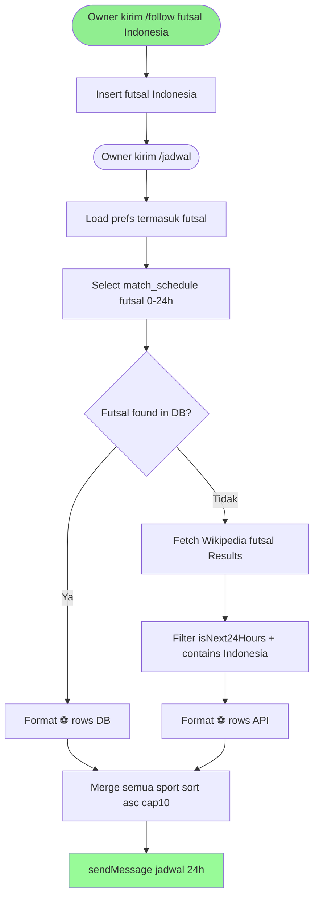
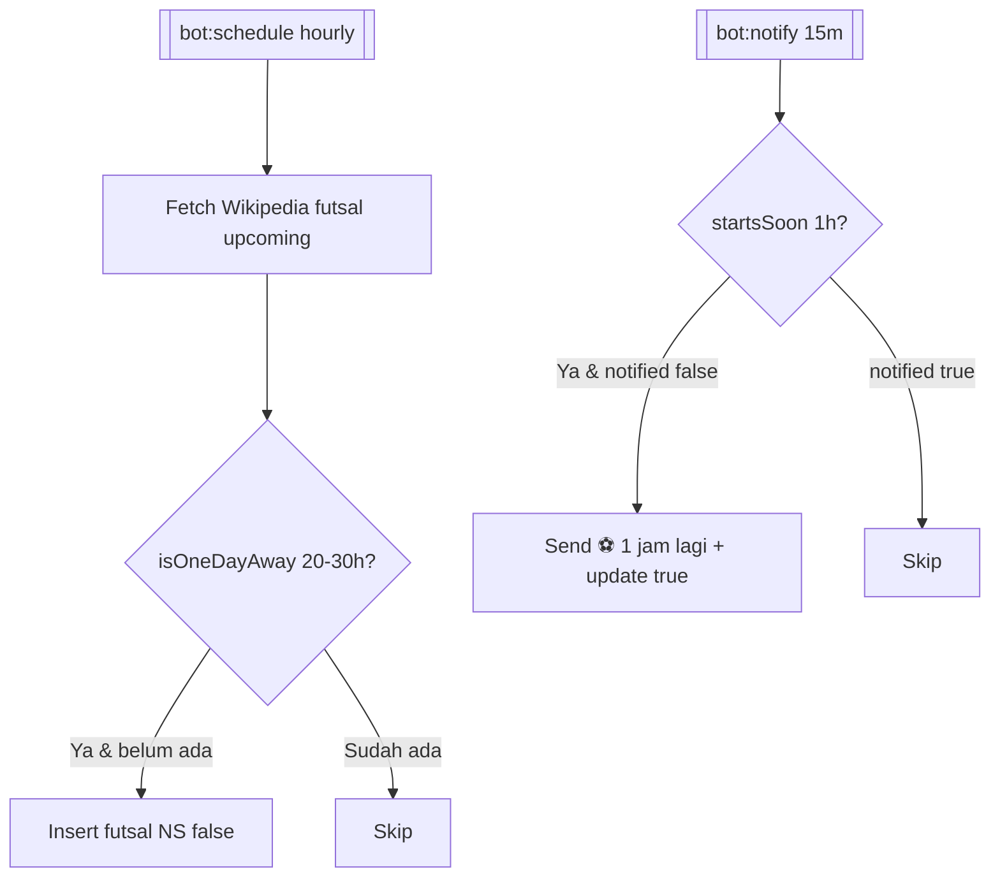

# Feature Specification: Timnas Futsal Indonesia — Jadwal 24 Jam di Telegram

**Feature Branch**: `005-timnas-futsal`  
**Created**: 2026-08-27  
**Status**: Draft  
**Input**: User description: "Timnas Futsal Indonesia: follow timnas futsal via Telegram, tampil di jadwal 24 jam DB-first per-sport fallback, sumber jadwal via Wikipedia Indonesia_national_futsal_team Results and Fixtures atau AFC AFF, cache 3 jam, tanpa table lokal baru, bahasa Indonesia"

## User Scenarios & Testing *(mandatory)*

### User Story 1 - Follow Timnas Futsal Indonesia (Priority: P1)

Owner kirim `/follow futsal Indonesia` (alias `/follow futsal timnas`, `/follow timnas futsal`). Bot tidak perlu hit provider luas — validasi statis: hanya `Indonesia` (dan alias `Timnas`, `Garuda`) diterima sebagai `sport_type=futsal`. Jika variasi lain seperti `futsal Thailand` diminta, balas `⚠️ Tim futsal luar belum didukung, hanya Indonesia` (ponytail ceiling). Simpan `user_preferences` `sport_type=futsal`, `entity_id=indonesia`, `entity_name=Indonesia`.

**Why this priority**: Pintu masuk data — tanpa pref ini, `/jadwal` tidak pernah filter futsal.

**Independent Test**: Kirim `/follow futsal Indonesia` → `✅ Memantau Indonesia di futsal` dan row `user_preferences` `futsal/indonesia` ada. Kirim `/follow futsal Jepang` → balas warning, tidak insert.

**Acceptance Scenarios**:

1. **Given** `/follow futsal Indonesia` **When** handler `normalizeSport(futsal)` + validasi statis `Indonesia` **Then** insert `futsal/indonesia` enabled true
2. **Given** `/follow futsal Timnas` atau `TIMNAS` **When** handler **Then** normalisasi ke `Indonesia` dan insert sama
3. **Given** `/follow futsal Thailand` **When** handler **Then** balas `⚠️ Hanya Indonesia yang didukung untuk futsal saat ini.` tidak insert
4. **Given** sudah follow Indonesia **When** `/myteams` **Then** baris `Indonesia (futsal) 🔔` muncul
5. **Given** `/unfollow futsal Indonesia` **When** handler **Then** delete pref futsal Indonesia

---

### User Story 2 - /jadwal tampilkan Timnas Futsal 24 jam DB-first + fallback Wikipedia (Priority: P1)

Owner kirim `/jadwal` → flow existing DB-first 0–24h: untuk `futsal`, baca `match_schedule` (`sport_type=futsal`, `status NS/scheduled`, `source_id:uUID`, `match_time` dalam `isNext24Hours`) dulu. Jika kosong per-sport, fallback `FutsalService::getUpcomingMatches()` scrape `en.wikipedia.org/wiki/Indonesia_national_futsal_team` section `Results and fixtures` (parse `Indonesia v Cambodia 5 September 2025 13:30 UTC+8`) atau `Indonesia_national_futsal_team_results` → filter `isNext24Hours` → tampil. Karena timnas hanya `Indonesia`, `NameMatcher` cukup `stripos(home/away, "Indonesia")`.

**Why this priority**: Inti request — jadwal timnas yang user ikuti muncul di `/jadwal`.

**Independent Test**: Pref futsal Indonesia ada. Mock `match_schedule` kosong futsal, mock Wikipedia scrape return `Indonesia vs Thailand 6 jam lagi`. `/jadwal` → `⚽ Indonesia vs Thailand — CFA/ASEAN Cup — ⏱️ WIB`.

**Acceptance Scenarios**:

1. **Given** row `match_schedule` futsal `Indonesia vs Malaysia` +5h ada **When** `/jadwal` **Then** tampil dari DB (tidak hit Wikipedia)
2. **Given** DB futsal kosong tapi Wikipedia punya `Indonesia vs Vietnam` +6h dalam 24h **When** `/jadwal` **Then** tampil dari fallback API scrape
3. **Given** DB + Wikipedia futsal kosong / di luar 24h **When** `/jadwal` **Then** balas `📭 Tidak ada jadwal dalam 24 jam` (tidak error)
4. **Given** pref futsal `notification_enabled=false` **When** `/jadwal` **Then** futsal diabaikan (tidak query DB/API futsal)

---

### User Story 3 - Scheduler & notifier simpan/kirim Timnas Futsal H-1 (Priority: P2)

Sama lifecycle football/volly/MLBB: `bot:schedule` simpan H-1 (20–30h via `isOneDayAway`) `match_schedule` `notified=false`; `bot:notify` kirim 1 jam (`startsSoon`) update `notified=true`. Timnas jarang tiap minggu — frekuensi tetap `hourly`/`15m` tapi no-op jika tidak ada fixture 20–30h/1h.

**Why this priority**: Tanpa scheduler, `/jadwal` bergantung penuh fallback; dengan scheduler jadwal H-1 muncul seperti sport lain.

**Independent Test**: Mock Wikipedia `Indonesia vs Thailand` +25h. `bot:schedule` → insert `futsal` `notified=false`. Mock +30m kickoff, `bot:notify` → `⚽ 1 jam lagi! Indonesia vs Thailand`.

**Acceptance Scenarios**:

1. **Given** fixture timnas +25h **When** `bot:schedule` **Then** insert `source_id=futsal-{date}:uUID` `sport_type=futsal`
2. **Given** `source_id` sudah ada **When** schedule lagi **Then** skip duplikat
3. **Given** fixture +30m dan row `notified=false` **When** `bot:notify` **Then** kirim notif dan update `notified=true`; jika `true` skip

---

### Edge Cases

- Wikipedia timeout/HTML berubah (class `.mw-parser-output` ganti) → catch → `getUpcomingMatches` return `[]` (fallback kosong), `/jadwal` tetap tampil DB, tidak crash; log warning
- Timezone Wikipedia `13:30 UTC+8` / `18:30 UTC+7 (GBK)` → parse offset, convert ke UTC `DateTimeZone('UTC')`, `DisplayTime::format` tampil WIB (`Asia/Jakarta`)
- Jika Wikipedia block / `api-terms` rate limit → respect cache 3h + backoff; `bot:schedule` hourly tetap hit cache, tidak spam
- Timnas hanya satu entitas — `NameMatcher` trivial; alias `Indonesia`, `Timnas`, `Garuda` semua map ke `Indonesia`
- Kompetisi 2026 sudah ada `AFC Futsal Asian Cup 2026 Jakarta` — scrape perlu filter future saja (`DateTime > now`), ignore hasil lama `5 May 2025 Indonesia 5-1 Cambodia` (sudah lewat)
- Cap 10 di `/jadwal` tetap — jika timnas + MLBB + football >10, slice asc + `… dan N lainnya`

## Requirements *(mandatory)*

### Functional Requirements

- **FR-001**: System MUST tambah `sport_type=futsal` ke `SportPrefsService::SPORTS` dengan validasi statis hanya `Indonesia` (normalisasi `timnas`/`garuda` → `Indonesia`) sebelum persist
- **FR-002**: System MUST simpan/hapus/list pref futsal via `SportPrefsService` sama sport lain (`myteams` tampil `futsal` dengan 🔔)
- **FR-003**: System MUST tampilkan futsal di `BotRouter::handleJadwal` DB-first: filter `match_schedule` `sport_type=futsal`, `status NS/scheduled`, `source_id:uUID`, `isNext24Hours` — tanpa `NameMatcher` kompleks (Indonesia single team)
- **FR-004**: System MUST fallback per-sport futsal: jika DB kosong untuk `futsal`, hit `FutsalService::getUpcomingMatches()` (cache `futsal.upcoming` 3h), filter `isNext24Hours` + contains `Indonesia`, merge sort asc
- **FR-005**: System MUST format baris futsal `⚽ Indonesia vs {lawan} — {kompetisi} — ⏱️ {DisplayTime WIB}` di `formatJadwalRow` dan fallback formatter (emoji sama football tapi kompetisi beda; bisa `🏟️` jika mau distinct)
- **FR-006**: System MUST tambah cabang futsal di `MatchScheduler` (H-1 20–30h `isOneDayAway`) insert `match_schedule` `notified=false` dan `MatchNotifier` (1h `startsSoon`) send `⚽ 1 jam lagi!` update `notified=true`
- **FR-007**: System MUST reuse `MatchHelper::isNext24Hours` / `isOneDayAway` / `isInWindow` — tidak duplikat parsing
- **FR-008**: System MUST menangani Wikipedia timeout/HTML berubah dengan per-sport try/catch tanpa crash router/scheduler (webhook tetap 200)
- **FR-009**: System MUST tidak menambah table lokal — tetap `user_preferences` + `match_schedule` via `SupabaseService` (External Data Only)
- **FR-010**: System MUST support alias `/follow futsal timnas`, `/follow futsal Indonesia`, `/follow futsal garuda` semua map ke `Indonesia`

### Non-Functional Requirements

- **NFR-001**: Balasan `/jadwal` dengan futsal tetap <5s saat fallback Wikipedia (cache hit <1s, scrape <5s, timeout 15s)
- **NFR-002**: Tidak tambah dependency baru selain `Http` + `Cache` existing; scrape HTML lean (regex/strip_tags)
- **NFR-003**: Outbound HTTP futsal timeout 15s; cache `futsal.upcoming` 3h, `futsal.teams` 1d (static 1 tim tetap cache)
- **NFR-004**: `composer test` dan `./vendor/bin/pint` hijau; style sama scheduler/notifier

### Key Entities *(include if feature involves data)*

- **user_preferences futsal**: Follow Timnas
  - Key attributes: `user_id`, `sport_type=futsal`, `entity_id=indonesia`, `entity_name=Indonesia`, `notification_enabled`
  - Relationships: drives filter `match_schedule futsal`

- **match_schedule futsal**: Jadwal timnas per-user
  - Key attributes: `source_id` (`futsal-{date}:uUID` atau `id:uUID`), `sport_type=futsal`, `competition` (`CFA Tournament`/`ASEAN Futsal`/`AFC Asian Cup`), `home_team` (`Indonesia`), `away_team` (`Cambodia`), `match_time` UTC, `status` NS/scheduled, `notified`
  - State lifecycle: `NS/false (H-1)` → `NS/true (notified 1h)` → `FT` (optional)
  - Relationships: single team `Indonesia`

- **Timnas Fixture (transient Wikipedia)**: `{id,date,home,away,league,status,timeZoneOffset}`
  - Owns: —
  - State lifecycle: `upcoming/NS` → `FT` (hanya upcoming dipakai)
  - Relationships: matched via contains `Indonesia` (trivial)

- **Telegram Update**: sama — `from.id` auth `OWNER_ID`, `chat.id`, `text`

## Success Criteria *(mandatory)*

### Measurable Outcomes

- **SC-001**: Owner follow `Indonesia` via `/follow futsal Indonesia` (atau `timnas`/`garuda`) berhasil dan muncul di `/myteams` dalam 1 interaksi
- **SC-002**: `/jadwal` menampilkan timnas 0–24h dari DB jika ada, fallback Wikipedia jika DB kosong — verifikasi mock DB kosong + mock Wikipedia +6h
- **SC-003**: `bot:schedule` simpan timnas H-1 idempotent dan `bot:notify` kirim H-1 jam (update `notified`)
- **SC-004**: Tidak regresi: `composer test` hijau, pint hijau, football/volly/motogp/mlbb tetap jalan (per-sport isolation)
- **SC-005**: Alias futsal hanya `Indonesia` diterima — follow `Thailand` ditolak dengan guidance, tidak insert pref liar

## UI/UX & Screens *(mandatory when the feature has a user interface)*

### Design Reference

- **Design source**: none — follow existing bot Markdown + emoji `⚽` (sama football, kompetisi `CFA`/`AFF` beda cukup)
- **Look & feel / brand**: Telegram Markdown, WIB via `DisplayTime`
- **Existing UI to match**: `BotRouter::MENU`, `WELCOME`, `myteams` list, `MatchNotifier` notifikasi

### Screen Inventory

| Screen | Purpose | Serves story | Key data shown | Primary actions |
| ------ | ------- | ------------ | -------------- | --------------- |
| Telegram chat `/follow futsal` | Follow Timnas | US1 | validasi statis Indonesia | `/follow futsal Indonesia`, `timnas`, `garuda` |
| Telegram chat `/jadwal` | Lihat timnas + sport lain 24h | US2 | `⚽ Indonesia vs Thailand — CFA/ASEAN — ⏱️ WIB` sorted asc, cap10 | `/jadwal` |
| Telegram `/myteams` | Daftar follow termasuk futsal | US1 | `Indonesia (futsal) 🔔` | `/myteams` |
| Telegram notif H-1 jam | Alert timnas 1 jam sebelum | US3 | `⚽ 1 jam lagi! Indonesia vs Thailand — CFA — ⏱️ WIB` | auto via `bot:notify` |
| Dashboard matches list | Lihat jadwal timnas H-1 | US3 | same `match_schedule` rows | read |

### Per-Screen Key States

- **`/follow futsal`**: loading none; error `⚠️ Hanya Indonesia yang didukung...` untuk team luar; success `✅ Memantau Indonesia di futsal`
- **`/jadwal`**: empty `📭 Tidak ada jadwal...` jika semua sport termasuk futsal kosong; error Wikipedia → `⚠️ Gagal ambil...` tapi DB tetap; populated header `📅 *Jadwal 24 jam ke depan*` + mixed rows, futsal pakai ⚽
- **`/myteams`**: empty `📭 Belum ada yang dipantau`; populated termasuk futsal rows
- **Notif H-1**: sent once per `source_id:uUID` guard `notified`

### Primary Interactions & Flows

- Follow: `/follow futsal timnas` → `normalizeSport` futsal → validasi `timnas→Indonesia` → `addPreference` → reply; `futsal thailand` → warning
- Jadwal: `/jadwal` → `getPreferences(uid)` → filter enabled → DB `match_schedule` 0–24h per sport (futsal termasuk) → if empty → `FutsalService::getUpcomingMatches` (Wikipedia scrape + cache) → `isNext24Hours` + contains Indonesia → `formatJadwalRow` ⚽ → sort cap10 → `sendMessage`
- Scheduler: `bot:schedule` hourly → prefs futsal Indonesia → `getUpcomingMatches` → `isOneDayAway` 20–30h → `sourceId` dedup → insert
- Notifier: `bot:notify` every15m → `startsSoon` 1h → match futsal → send + update `notified`

## Business Process Flow *(visual aid)*

### Primary User Journey Flow

### Alternative/Secondary Flows

## Business Actors & Interactions

| Actor | Role | Key Interactions |
| ----- | ---- | ---------------- |
| Owner (`OWNER_ID`) | Single human | `/follow futsal Indonesia`, `/jadwal`, `/myteams`, terima notif timnas H-1 |
| BotRouter | System router | auth, route futsal follow/jadwal |
| SportPrefsService | Store | persist `futsal` `Indonesia` |
| Supabase `user_preferences`/`match_schedule` | Store (External) | sumber follow & jadwal per-user |
| FutsalService (baru) | Provider adapter | `getUpcomingMatches` Wikipedia scrape + cache 3h |
| Wikipedia en.wikipedia.org | External | `Indonesia_national_futsal_team` Results and fixtures |
| Football/Volley/MotoGP/MLBB | Peers | tidak terpengaruh (per-sport isolation) |

## Assumptions

- Timnas Futsal hanya 1 entitas `Indonesia` — tidak perlu `searchTeams` dinamis luas; static list `Indonesia` cukup untuk validasi dan `NameMatcher` trivial.
- Sumber provisional Wikipedia `Results and fixtures` (`v Cambodia 5 Sep 2025 13:30 UTC+8`) — scrape via regex `Indonesia v Cambodia + time + UTC` dan filter future `> now`. Jika AFC punya endpoint resmi stabil di masa depan, `FUTSAL_API_URL` bisa di-switch tanpa ubah consumer.
- Kompetisi `AFC Futsal Asian Cup 2026`, `ASEAN Futsal Championship`, `CFA Tournament` diambil dari league text Wikipedia.
- Alias `timnas`/`garuda` map ke `Indonesia` sebelum persist/query — `SPORTS` tetap `futsal` singular.
- Timezone Wikipedia `UTC+8`/`UTC+7` harus di-convert ke UTC untuk `MatchHelper` filter lalu `DisplayTime` ke WIB.
