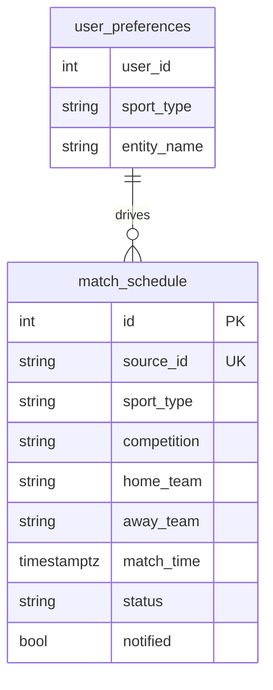
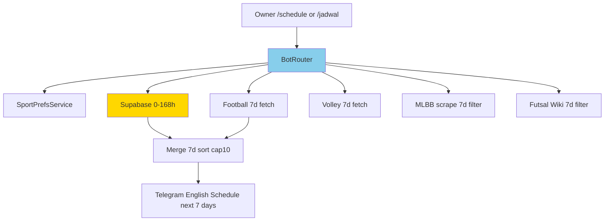
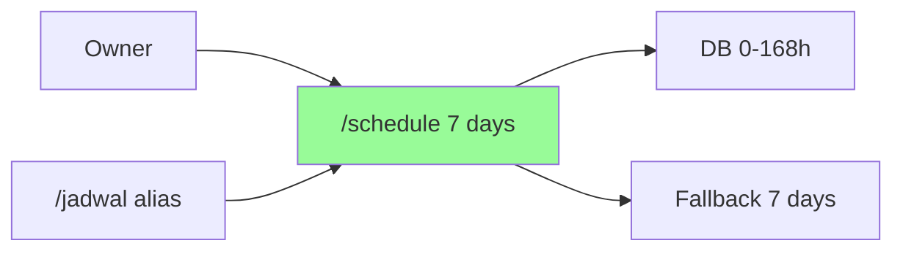
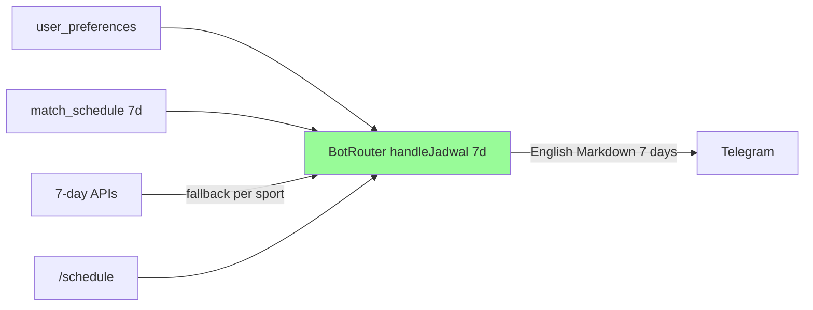
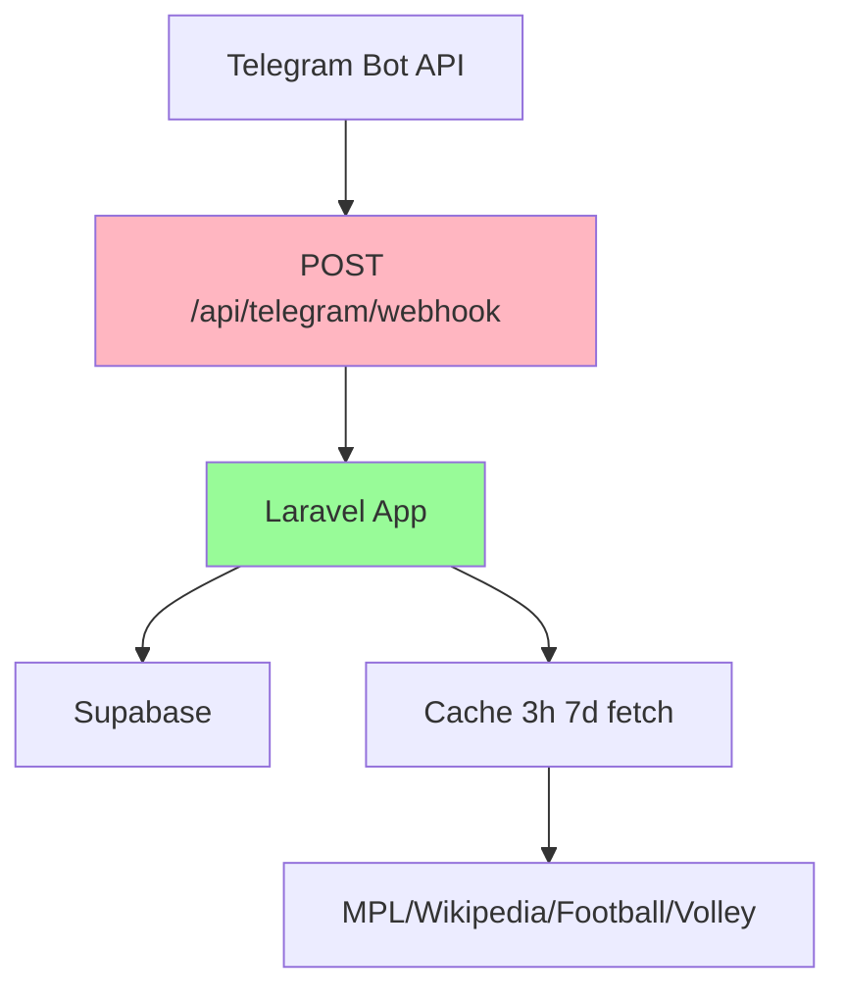

# Implementation Plan: Schedule 7 Days English — /schedule 1 Minggu

**Branch**: `006-schedule-7d-english` | **Date**: 2026-08-27 | **Spec**: `specs/006-schedule-7d-english/spec.md`
**Input**: Feature specification from `specs/006-schedule-7d-english/spec.md`

## Summary

Ubah jendela jadwal `0–24h → 0–168h (7 hari)` dengan helper baru `isNext7Days`/`NEXT_7D_HOURS=168`, ganti primary command English `/schedule` (keep alias `/jadwal`/`/next`), update DB filter 7d, perluas API fallback fetch 7 hari (football/volly 7 dates), header English `Schedule next 7 days`, MENU `schedule` English, tanpa table baru.

## Technical Context

**Language/Version**: PHP 8.3, Laravel 13  
**Primary Dependencies**: BotRouter, MatchHelper, FootballService, VolleyballService, MobileLegendService, FutsalService, SportPrefsService, SupabaseService, DisplayTime, TelegramService  
**Storage**: Supabase `match_schedule` + `user_preferences` (REST, no new table); Cache `football.upcoming` 3h, `mlbb.upcoming` 3h, `futsal.upcoming` 3h  
**Testing**: PHPUnit 12, SQLite in-memory — Http::fake + Mockery, cache flush  
**Target Platform**: Laravel BotRouter (webhook prod `POST /api/telegram/webhook` + polling `bot:listen`)  
**Project Type**: Web app monolith (Laravel+Vue SPA + Telegram bot)  
**Architecture Type**: Monolith — single app SPA catch-all + API + Console Commands  
**Integration Target**: Telegram `sendMessage`/`setMyCommands`, Supabase REST, Football/Volley/MPL-AFC/Wikipedia APIs  
**Existing Design System**: Bot-only Telegram Markdown + emoji per sport `⚽`/`🏐`/`🏍️`/`🎮`, dashboard Emerald Nocturne tidak tersentuh  
**Performance Goals**: `/schedule` 7d reply <5s (DB <1s, fallback 7dates cache 3h), webhook 200  
**Constraints**: HTTP 15s timeout; cache 3h quota; single-owner `OWNER_ID`; rolling 168h window (not calendar week)  
**Scale/Scope**: 1 user OWNER_ID, ~20-50 fixtures/week across sports, cap 10 reply

## UI/UX & Screens (carried from spec)

- **Design reference**: none — follow existing bot Markdown English
- **Screens**:
  - Telegram chat `/schedule` (primary) + aliases `/jadwal`/`/next` → header `📅 Schedule next 7 days` + sorted asc cap10 English `… and N more`
  - Menu `/` → `schedule — Check schedule next 7 days — /schedule` English
  - Help `/help` → line `/schedule — check schedule next 7 days` English
- **Primary flows**: Alias all route to same `handleJadwal` English, DB 0–168h → per-sport fallback 7d → merge sort cap10

## Constitution Check

*GATE: Must pass before Phase 0 research. Re-check after Phase 1 design.*

- [x] I. External Data Only — still Supabase HTTP, no local table
- [x] II. Single-Owner Scope — same `OWNER_ID` whitelist
- [x] III. Tests Ship With Changes — update `BotRouterScheduleTest`, `MatchHelperTest` to 7d
- [x] IV. One Handler Path — BotRouter shares `FutsalService`/`MobileLegendService`/`MatchHelper`
- [x] V. Timezone Discipline — filter UTC `isNext7Days`, display WIB `DisplayTime`
- [x] VI. Simplicity Over Speculation — reuse `isInWindow`, 1 const, 1 helper, no new table
- Gate: PASS

## Project Structure

### Documentation (this feature)

```text
specs/006-schedule-7d-english/
├── spec.md
├── plan.md              # This file
├── research.md          # Phase 0 output
├── data-model.md        # Phase 1 output
├── quickstart.md        # Phase 1 output
├── contracts/           # Phase 1 output
└── tasks.md             # Phase 2 output (NOT created by /pandawa.plan)
```

### Source Code (repository root)

```text
app/
├── Support/MatchHelper.php        # MOD: add NEXT_7D_HOURS=168 + isNext7Days
├── Services/
│   ├── BotRouter.php              # MOD: MENU schedule English, WELCOME, handleJadwal 7d header isNext7Days
│   ├── FootballService.php        # MOD: fetch 7 dates (today..+6)
│   ├── VolleyballService.php      # MOD: fetch 7 dates
│   ├── MobileLegendService.php    # MOD: filter 7d (already scrape many days, just filter 168h)
│   └── FutsalService.php          # MOD: filter 7d
└── Http/Controllers/Api/
```

**Structure Decision**: Monolith — 1 helper const + 5 services filter 7d, BotRouter MENU/header English, keep alias, no new service.

## Complexity Tracking

| Violation | Why Needed | Simpler Alternative Rejected Because |
| --------- | ---------- | ------------------------------------ |
| none | — | — |

---

## Technical Diagrams

### Data Design Decisions

| Source resource / sub-resource | Table(s) | Mapping | Rationale |
| ------------------------------ | -------- | ------- | --------- |
| `match_schedule` per-user | `match_schedule` | mirror — filter `match_time 0–168h` for display (H-1 insert still 20–30h) | reuse, display window widened only |
| `user_preferences` | `user_preferences` | mirror — `sport_type` same | reuse |
| Fixture 7d (football/volly 7 dates) | transient API | no table — fetch 7 dates then `isNext7Days` | widen fetch to match window |
| MLBB/Wikipedia 7d | transient scrape | no table — many days scraped, filter 168h | already many days, just filter |

No new table. `match_schedule` H-1 lifecycle unchanged.

### Data Model (Entity Relationship Diagram)



### System Architecture



### Use Case Diagram



### Data Flow Diagram (Level 0)



### API Contract Overview

No dashboard HTTP API change. Bot contracts:

| Operation | Trigger | Method | Purpose |
| --------- | ------- | ------ | ------- |
| Schedule 7d | `/schedule` primary, `/jadwal`/`/next` alias | Telegram message | reply 0–168h English, per-sport fallback 7d |

### Deployment Architecture



## Decisions

- **NEXT_7D_HOURS=168 + isNext7Days**: Wrapper `isInWindow(now, now+168h)` — keep `isNext24Hours` for legacy tests but new code uses 7d. Ponytail: tune here, not per caller.
- **Fetch 7 dates**: Football/Volly loop `for i 0..6 addDay()` vs today+tomorrow 2 — +5 req per fallback, still under 100/day with 3h cache; alternative keep 2 days but 7d DB would be partial — choose 7 days for correctness.
- **MENU primary `schedule`**: `BotRouter::MENU = ['schedule'=>English,...]` keep handler `if in_array(text, ['/jadwal','/schedule','/next'])` — backward compat, menu shows English.
- **Header English**: `📅 Schedule next 7 days` + `No schedule...` + `… and N more` — per request bahasa Inggris for schedule feature.
- **Keep isNext24Hours**: Not deleted — H-1 scheduler still uses `isOneDayAway` 20–30h, legacy tests may still call it; new `isNext7Days` for display.
