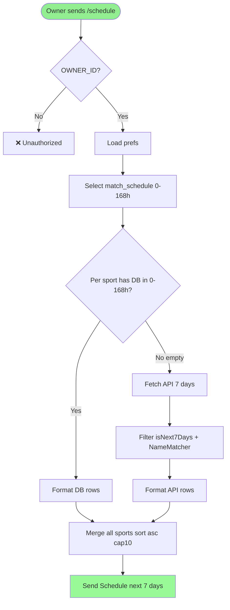
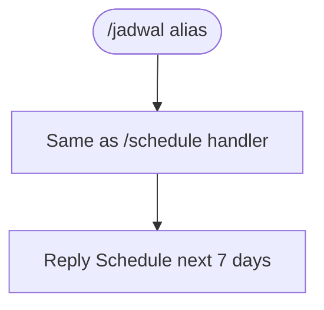

# Feature Specification: Schedule 7 Days English — /schedule 1 Minggu

**Feature Branch**: `006-schedule-7d-english`  
**Created**: 2026-08-27  
**Status**: Draft  
**Input**: User description: "Ubah pengecekan jadwal dari 1 hari (24 jam) menjadi 1 minggu (7 hari/168 jam), ganti command Telegram /jadwal menjadi bahasa Inggris /schedule sebagai primary (keep alias /jadwal dan /next), update jendela DB 0-168 jam, API fallback fetch 7 hari (football/volly/mlbb/futsal), header Schedule next 7 days, MENU schedule English, bahasa output English"

## User Scenarios & Testing *(mandatory)*

### User Story 1 - Cek jadwal 1 minggu via /schedule English (Priority: P1)

Owner yang sudah follow tim kirim `/schedule` (primary English) dan dapat daftar jadwal kickoff **0–168 jam (7 hari)** ke depan untuk semua sport yang difollow (football/volly/motogp/mlbb/futsal). Sumber DB-first: `match_schedule` filter 0–168h, lalu per-sport fallback API yang juga fetch 7 hari. Tampilan header English `📅 Schedule next 7 days`, tiap baris `emoji home vs away — league — ⏱️ WIB`, sorted asc, cap 10.

**Why this priority**: Inti request — user mau 1 minggu bukan 1 hari, dan command harus English. Tanpa ini value tidak ada.

**Independent Test**: Pref football Arsenal. Insert `match_schedule` Arsenal +5h dan +5d (120h). Kirim `/schedule` → balas mengandung keduanya sorted. Kirim `/schedule` dengan alias `/jadwal` tetap sama.

**Acceptance Scenarios**:

1. **Given** ada match `Indonesia W vs Thailand` +6h dan `BTR vs NAVI` +5d (120h) untuk sport yang difollow **When** `/schedule` **Then** balas kedua match sorted asc dalam window 0–168h
2. **Given** match +8d (192h) **When** `/schedule` **Then** tidak tampil (di luar 7 hari)
3. **Given** pengirim bukan `OWNER_ID` **When** `/schedule` **Then** balas `❌ Unauthorized` tanpa query DB/API
4. **Given** owner belum follow apa pun **When** `/schedule` **Then** balas `📭 No teams followed. Use /follow [sport] [team].` (English)

---

### User Story 2 - Alias backward compatibility & MENU English (Priority: P1)

`/jadwal` tetap alias ke handler sama (tidak breaking), `/next` juga. Menu `BotRouter::MENU` ganti primary `schedule => "Check schedule next 7 days — /schedule"` dan `WELCOME` help baris Inggris. Webhook `bot:webhook` publish menu English.

**Why this priority**: Rename harus English tapi tidak break user lama yang sudah pakai `/jadwal`.

**Independent Test**: `/jadwal`, `/schedule`, `/next` semua trigger sama. `BotRouter::MENU` contains `schedule` not `jadwal` as primary key, `/help` contains `/schedule`.

**Acceptance Scenarios**:

1. **Given** kirim `/jadwal` **When** handler **Then** same result as `/schedule`
2. **Given** `/help` **When** bot reply **Then** baris `"/schedule — check schedule next 7 days"` muncul (English)
3. **Given** `BotRouter::MENU` **When** `bot:webhook` publish **Then** `setMyCommands` includes `schedule` (English) — `/jadwal` optional alias tidak wajib di menu

---

### User Story 3 - Fallback API 7 hari per-sport (Priority: P1)

Jika DB per-sport kosong dalam 0–168h, fallback hit API dan harus fetch 7 hari (bukan 2). Football fetch 7 dates, Volly 7 dates, MLBB scrape filter 7 hari, Futsal Wikipedia scrape filter 7 hari — semua filter `isNext7Days` (0–168h) + `NameMatcher`.

**Why this priority**: Tanpa fetch 7 hari, fallback 24h lama akan miss jadwal 3–7 hari yang baru ada di window.

**Independent Test**: DB kosong, mock `FootballService` dengan fixture +3d dan +6d untuk Arsenal → `/schedule` tampil keduanya. Mock fixture +8d → tidak tampil.

**Acceptance Scenarios**:

1. **Given** DB football kosong dan API punya 2 fixtures +2d dan +6d match pref **When** `/schedule` **Then** kedua tampil (sorted)
2. **Given** DB football ada tapi volly kosong **When** `/schedule` **Then** football dari DB, volly fallback API 7 hari (per-sport isolation)
3. **Given** API MLBB `id-mpl.com` scrape punya `28 Agt ...` yang 5 hari lagi **When** `/schedule` (sekarang 23 Agt) **Then** tampil karena dalam 7 hari
4. **Given** API timeout **When** `/schedule` **Then** balas `No schedule ...` atau hasil DB saja, tidak crash (webhook 200)

---

### Edge Cases

- Window 0–168h: `now < match_time <= now+168h` (MatchHelper `isNext7Days`). `match_time == now` tidak tampil (strict > now)
- Cap 10: jika >10 dalam 7 hari → slice 10 + `… and N more` (English)
- Per-sport isolation: football ada DB 3 match dalam 7 hari, volly kosong → hanya volly hit API, football tidak
- Quota: football 7 dates ×1req =7 req/fallback vs 2 sebelumnya — cache 3h `mlbb.upcoming`/`football.upcoming` tetap, max fallback ~7 req per `/schedule` hit, still under 100/day jika `/schedule` jarang
- Bahasa: semua reply baru English (`No schedule in the next 7 days.`, `No teams followed...`, header `Schedule next 7 days`, `and N more`), tapi `Unauthorized` sudah English tetap
- Timezone: semua filter UTC `isNext7Days` (UTC), display WIB `DisplayTime` (`Asia/Jakarta`)
- `/jadwal` alias tetap support untuk backward compat, tidak dihapus

## Requirements *(mandatory)*

### Functional Requirements

- **FR-001**: System MUST handle Telegram command `/schedule` as primary English for 7-day schedule, with aliases `/jadwal` and `/next` routing to same handler (all three trigger `handleJadwal`)
- **FR-002**: System MUST change window from 0–24h to 0–168h (7 days): DB query `match_schedule` filter `match_time > now && <= now+168h` and fallback `MatchHelper::isNext7Days` (new helper) for all sports; header `📅 Schedule next 7 days`
- **FR-003**: System MUST update fallback fetch to 7 days: `FootballService::getUpcomingFixtures` fetch today..today+6 (7 dates), `VolleyballService::getUpcomingGames` same 7 dates, `MobileLegendService` and `FutsalService` filter 0–168h (scrape already returns many days, just filter 168h)
- **FR-004**: System MUST keep per-sport isolation for 7-day window: sport with DB results in 0–168h does not hit API for that sport; sport with empty DB does hit API 7 days
- **FR-005**: System MUST update `BotRouter::MENU` primary key `schedule => "Check schedule next 7 days — /schedule"` (English) and `WELCOME` help line `/schedule — check schedule next 7 days` (English); `RegisterWebhook` will publish English menu
- **FR-006**: System MUST translate user-facing empty/error messages to English: `📭 No schedule in the next 7 days.`, `📭 No teams followed. Use /follow [sport] [team].`, `… and N more`, `⚠️ Failed to fetch schedule: {msg}` while keeping unauthorized `❌ Unauthorized` unchanged
- **FR-007**: System MUST reuse `MatchHelper::isNext7Days` / `NEXT_7D_HOURS=168` wrapper around `isInWindow(now, now+168h)` — no duplicated DateTime logic
- **FR-008**: System MUST keep alias `/jadwal` functional (no breaking change) but de-emphasized in docs/menu
- **FR-009**: System MUST not add new table — still `user_preferences` + `match_schedule` via `SupabaseService`
- **FR-010**: System MUST cap reply to 10 earliest matches sorted asc `match_time`/`date` within 7 days, with overflow `… and N more` English

### Non-Functional Requirements

- **NFR-001**: `/schedule` reply <5s fallback (cache hit <1s) with 7-day fetch (max 7 HTTP calls, each 15s timeout, cached)
- **NFR-002**: No new dependency; reuse `Cache` 3h, `Http` timeout 15s
- **NFR-003**: Webhook must answer 200 even on 7-day fallback error (per-sport try/catch)
- **NFR-004**: `composer test` and `pint` green

### Key Entities *(include if feature involves data)*

- **Telegram Update**: `from.id`, `chat.id`, `text` (`/schedule`/`/jadwal`/`/next`)
  - Relationships: drives `sport_preferences` + `match_schedule`/`FutsalService` etc.

- **user_preferences**: same as before, drives filter
  - Key attributes: `user_id`, `sport_type` (football, volly, motogp, mobilelegend, futsal), `entity_name`, `notification_enabled`

- **match_schedule**: per-user per-match
  - Key attributes: `source_id`, `sport_type`, `competition`, `home_team`, `away_team`, `match_time` UTC, `status` NS/scheduled, `notified`
  - State lifecycle: unchanged (H-1 20–30h insert, not 7 days)
  - Relationships: filtered via `isNext7Days` for `/schedule` display only

- **Fixture (transient)**: `{id,date,home,away,league}` from Football/Volley/MLBB/Futsal 7-day fetch

## Success Criteria *(mandatory)*

### Measurable Outcomes

- **SC-001**: Owner sends `/schedule` and sees matches 0–7 days for followed teams sorted asc within 5s (verified with mock DB + API 5 days ahead)
- **SC-002**: `/jadwal` alias still returns same result as `/schedule` (backward compat)
- **SC-003**: Menu `/` and `/help` show `schedule` in English (`Check schedule next 7 days — /schedule`)
- **SC-004**: `composer test` green, no regression for 24h window tests updated to 7 days
- **SC-005**: Empty case shows English `No schedule in the next 7 days.` and no crash on API timeout

## UI/UX & Screens *(mandatory when the feature has a user interface)*

### Design Reference

- **Design source**: none — follow existing bot Markdown English, emoji per sport `⚽`/`🏐`/`🏍️`/`🎮` same
- **Look & feel / brand**: Telegram Markdown, WIB via `DisplayTime`
- **Existing UI to match**: Existing schedule reply but header English

### Screen Inventory

| Screen | Purpose | Serves story | Key data shown | Primary actions |
| ------ | ------- | ------------ | -------------- | --------------- |
| Telegram chat `/schedule` | Check schedule 7 days English | US1, US3 | `⚽ home vs away — league — ⏱️ WIB` sorted asc cap10, header `Schedule next 7 days` | `/schedule`, `/jadwal`, `/next` |
| Telegram menu `/` | Discoverability English | US2 | `schedule — Check schedule next 7 days — /schedule` | tap |
| Telegram `/help` | Help English | US2 | line `/schedule — check schedule next 7 days` | `/help` |

### Per-Screen Key States

- **Telegram `/schedule`**: loading none (sync); empty `📭 No schedule in the next 7 days.`; error `⚠️ Failed to fetch schedule: ...` but DB results still show if any; populated `📅 Schedule next 7 days` + 1..10 lines + `… and N more`
- **Menu `/`**: shows `schedule`, optional `jadwal` not required
- **Help**: contains `/schedule` English

### Primary Interactions & Flows

- User sends `/schedule` (or `/jadwal` alias) → `BotRouter::handle()` → `handleJadwal()` English header, DB 0–168h → per-sport fallback 7d → merge sort cap10 → `sendMessage`
- `/help` shows `/schedule` line

## Business Process Flow *(visual aid)*

### Primary User Journey Flow

### Alternative/Secondary Flows

## Business Actors & Interactions

| Actor | Role | Key Interactions |
| ----- | ---- | ---------------- |
| Owner | Single human (`OWNER_ID`) | Sends `/schedule`/`/jadwal`/`/next`, sees 7-day schedule |
| BotRouter | System router | Routes `/schedule` aliases, DB 7d, fallback 7d, English header |
| Supabase `match_schedule` | Store | 0–168h source |
| Football/Volley/MLBB/Futsal APIs | Providers | 7-day fallback source |
| Telegram Bot API | Channel | Receives command, sends English Markdown reply |

## Assumptions

- Window 7 days = rolling 0–168h from `now` UTC (not calendar week Mon-Sun) — simplest filter `isNext7Days(now, now+168h)`; calendar week easy to switch to `startOfDay` if user requests.
- Primary command English `schedule`, alias `jadwal` + `next` kept for back-compat — MENU de-emphasizes `jadwal` but handler still supports it.
- API fetch 7 days increases calls from 2 to 7 per fallback — acceptable with 3h cache; alternative lazy: keep fetch 2 days and just widen DB window, but we choose 7 days fetch for correctness.
- Header English `Schedule next 7 days` and empty `No schedule...` assume user wants full English output for schedule feature as requested.
