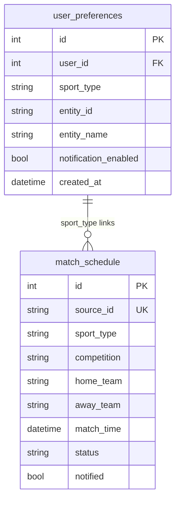
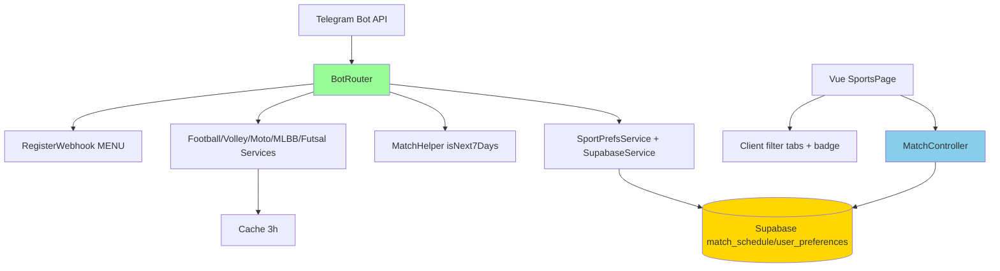
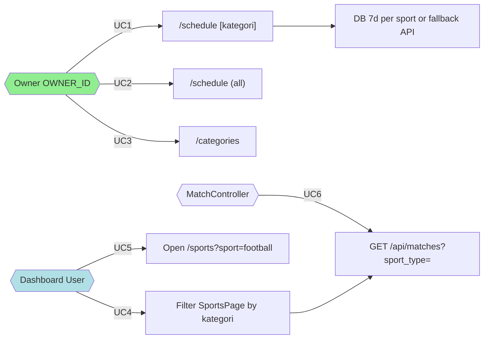
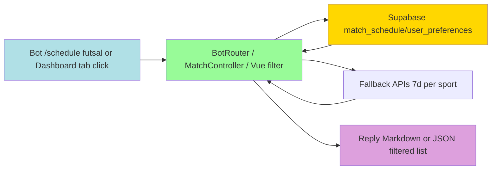
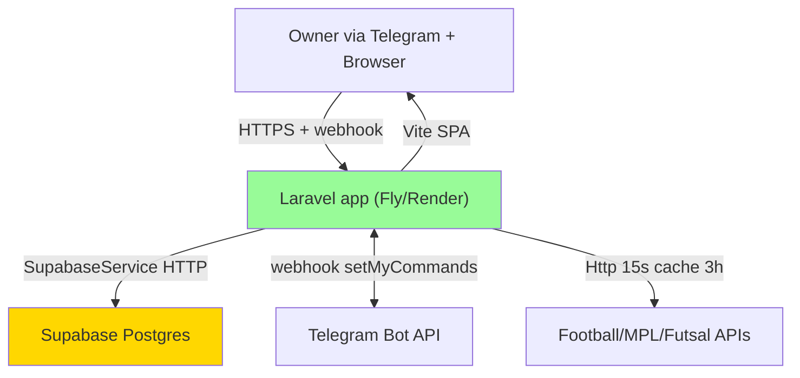

# Implementation Plan: Cek Kategori Pertandingan

**Branch**: `007-cek-kategori-pertandingan` | **Date**: 2026-09-02 | **Spec**: [spec.md](spec.md)
**Input**: Feature specification from `/specs/007-cek-kategori-pertandingan/spec.md`

## Summary

Tambah filter kategori pertandingan agar owner bisa cek jadwal per sport. Bot: `/schedule [kategori]` (single, optional, validasi SPORTS+alias) filter prefs+DB+fallback hanya sport itu, header dinamis. API: `GET /api/matches?sport_type=` optional filter. Dashboard: tabs kategori di `SportsPage.vue` client-side filter (single fetch, no re-fetch), deep-link `?sport=`, badge count. Command `/categories` list kategori + count follow. Window tetap 7 hari (168h), no migrasi.

## Technical Context

**Language/Version**: PHP 8.3 + JS (Vue 3.5)  
**Primary Dependencies**: Laravel 13, Vue 3.5 / Vue Router 4 / Pinia 4, Tailwind CSS 4, Vite 8, laravel-vite-plugin 3, Supabase HTTP, Telegram Bot API  
**Storage**: Supabase Postgres (`match_schedule`, `user_preferences`) + Google Sheets (expenses, not used here) — no local DB for app data (SQLite only for test infra)  
**Testing**: PHPUnit 12 (sqlite in-memory), `composer test`, Pint  
**Target Platform**: Web SPA (Vite) + Telegram webhook/long-poll  
**Project Type**: Web SPA monolith + bot (single Laravel app)  
**Architecture Type**: Laravel monolith (detected: `composer.json` laravel + `artisan`)  
**Integration Target**: Monolith SPA catch-all `routes/web.php` → Vue Router; `routes/api.php` JSON behind `SupabaseAuth`; Telegram `POST /api/telegram/webhook`  
**Existing Design System**: Tailwind 4 `@theme` Emerald Nocturne in `resources/css/app.css`, no `tailwind.config.js`, Lucide icons (`@lucide/vue`), `StatCard/Navbar/Sidebar` patterns — reuse for tabs/pills, `bg-surface-container`, `border-outline-variant/20`, `rounded-lg`, `bg-primary-container` active state  
**Performance Goals**: Bot per-kategori reply <3s (single sport fallback max 7 HTTP cached 3h), API `GET /api/matches?sport_type=` <500ms p95, dashboard tab switch instant (client filter, no network)  
**Constraints**: SupabaseAuth cookie verbatim no EncryptCookies, `OWNER_ID` whitelist, 7-day window `isNext7Days` (0-168h), cap 10 sorted asc, fallback per-sport isolation  
**Scale/Scope**: Single owner bot + single dashboard user, 8 sport types, ≤50 `match_schedule` rows, fallback 7 dates per sport

## UI/UX & Screens (carried from spec)

- **Design reference**: none — follow Emerald Nocturne `resources/css/app.css`, Tailwind 4, Lucide icons; match `SportsPage.vue` existing card style
- **Screens**:
  - Telegram `/schedule [kategori]` → cek jadwal per kategori: header `📅 Schedule [kategori] — next 7 days` (atau `next 7 days` tanpa kategori), 1..10 lines emoji sport + `home vs away — league — ⏱️ WIB`, overflow `… and N more`; states: empty kategori-spesifik, error kategori tidak dikenal, unauthorized, populated
  - Telegram `/categories` (alias `/kategori`, `/category`) → list kategori + count `📊 Kategori: football (2), volly (0)...` + hint `/schedule [kategori]`; always populated
  - Dashboard `/sports` → filter tabs (Semua + 8 sport) + badge count + list match filtered client-side; states: loading error `Gagal memuat data`, empty per kategori `Tidak ada pertandingan mendatang`, populated with counts, active tab `bg-primary-container`; deep-link `?sport=football` via URL
  - API `GET /api/matches?sport_type=` → filtered JSON, 400 on invalid
- **Primary interactions/flows**:
  - `/schedule futsal` → parse arg single → normalizeSport → filter prefs futsal only → DB 0-168h futsal → fallback FutsalService if empty → sort cap10 → reply
  - `/sports?sport=football` → fetch `GET /api/matches` (single fetch all) → compute counts → apply client filter `sport_type===football` → pushState on tab click

## Constitution Check

*GATE: Must pass before Phase 0 research. Re-check after Phase 1 design.*

- [x] I Spec-Driven: spec + plan before code — ok (`spec.md` exists, this plan)
- [x] II Test-First: new controller/bot branches need Feature/Unit tests, regression for filtered schedule — plan includes tasks
- [x] III Supabase/Sheets source: no local DB, via `SupabaseService` — enforced
- [x] IV Security: bot `OWNER_ID` whitelist, dashboard `SupabaseAuth` (no EncryptCookies) — preserved for new endpoints
- [x] V Simplicity: YAGNI single kategori only, client-side filter, no migration, reuse `normalizeSport`/`MatchHelper` — pass

Post-design re-check: same — no new storage, no auth weakening, no speculative abstraction.

## Project Structure

### Documentation (this feature)

```text
specs/007-cek-kategori-pertandingan/
├── plan.md              # This file
├── research.md          # Phase 0 output
├── data-model.md        # Phase 1 output
├── quickstart.md        # Phase 1 output
├── contracts/           # Phase 1 output
└── tasks.md             # Phase 2 output (NOT created by /pandawa.plan)
```

### Source Code (repository root)

```text
# Laravel monolith (detected: composer.json + artisan)
app/
├── Http/Controllers/
│   └── Api/MatchController.php          # add sport_type filter
├── Services/
│   ├── BotRouter.php                   # handleJadwal with kategori arg + handleCategories + MENU
│   └── SportPrefsService.php           # normalizeSport already, maybe add display mapping
└── Support/
    └── MatchHelper.php                 # reuse isNext7Days

resources/
├── js/
│   ├── views/SportsPage.vue            # tabs filter client-side
│   └── api/client.js                   # matchApi.list with sport_type param?
└── css/app.css                         # @theme tokens

routes/
├── api.php                             # GET /api/matches with sport_type, GET /api/categories? optional
└── web.php                             # SPA catch-all

tests/
├── Feature/
│   ├── BotCategoryTest.php             # new
│   ├── MatchCategoryApiTest.php        # new
│   └── SportsPageCategoryTest? (or JS)
└── Unit/
    └── MatchHelperTest.php             # existing, reuse
```

**Structure Decision**: Laravel monolith — edit existing controllers/services/views, no new top-level app.

## Complexity Tracking

> **Fill ONLY if Constitution Check has violations that must be justified**

| Violation | Why Needed | Simpler Alternative Rejected Because |
| --------- | ---------- | ------------------------------------ |
| none | — | — |

---

## Technical Diagrams

### Data Design Decisions

No new tables — reuse existing `match_schedule` and `user_preferences`. Mapping mirrors source (Supabase) 1:1.

| Source resource / sub-resource | Table(s) | Mapping | Rationale |
| ------------------------------ | -------- | ------- | --------- |
| match_schedule | `match_schedule` | mirror | existing, add `sport_type` filter only |
| user_preferences | `user_preferences` | mirror | existing, group count per sport_type |
| Fixture transient (API) | — transient | — | FootballService etc. already return with sport implicit, filtered via NameMatcher |

### Data Model (Entity Relationship Diagram)



### System Architecture



### Use Case Diagram



### Data Flow Diagram (Level 0)



### API Contract Overview

| Operation | Endpoint | Method | Purpose |
| --------- | -------- | ------ | ------- |
| List matches (all or filtered) | `/api/matches?sport_type={sport}` | GET | Fetch upcoming matches, optional sport filter |
| List categories with counts | `/api/categories` (optional) or bot only | GET | Return SPORTS + prefs count (or bot does grouping) |
| Export ICS | `/api/matches/export.ics` | GET | Existing, optional sport filter later |
| Bot schedule per kategori | Telegram `/schedule [kategori]` | — | Via `BotRouter::handleJadwal(uid,cid,tg,category?)` |
| Bot categories | Telegram `/categories` | — | Via `BotRouter::handleCategories` |

### Deployment Architecture


