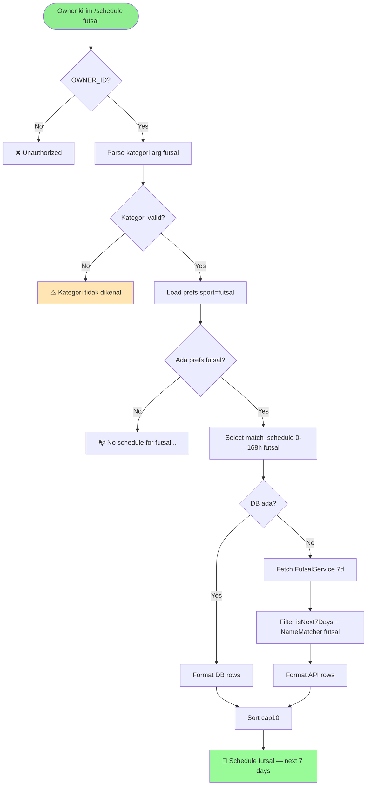
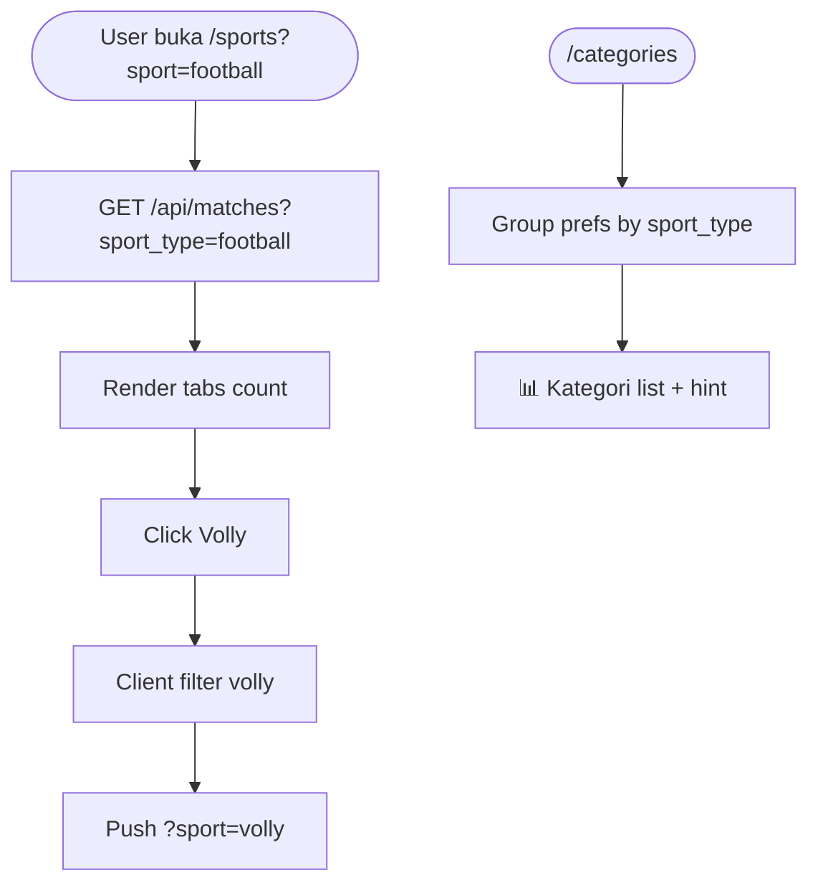

# Feature Specification: Cek Kategori Pertandingan

**Feature Branch**: `007-cek-kategori-pertandingan`  
**Created**: 2026-09-02  
**Status**: Draft  
**Input**: User description: "tambahkan fitur untuk mengecek setiap kategori pertandingan"

## Clarifications

### Session 2026-09-02

- Q: Berapa kategori per perintah /schedule (single vs multi)? → A: Single kategori per command (A). `/schedule football` valid, multi-kategori tidak didukung.
- Q: Filter motogp aggregasi vs exact? → A: Aggregasi (A). `/schedule motogp` tampilkan semua class motogp/moto2/moto3/baggers.
- Q: Dashboard filter fetch strategy? → A: Client-side (A). Fetch sekali semua, tab switch tanpa re-fetch; deep-link tetap bisa via client filter.

## User Scenarios & Testing *(mandatory)*

### User Story 1 - Cek jadwal per kategori via Bot Telegram (Priority: P1)

Owner mengirim perintah kategori ke bot untuk melihat jadwal hanya untuk satu kategori olahraga. Contoh: `/schedule football` hanya menampilkan sepak bola, `/schedule futsal` hanya futsal, `/schedule mlbb` hanya Mobile Legend. Tanpa argumen (`/schedule`) tetap tampil semua kategori yang difollow seperti sekarang. Bot memvalidasi kategori, filter preferensi + jadwal (DB + fallback API) hanya untuk sport tersebut.

**Why this priority**: Inti request "mengecek setiap kategori" — tanpa filter per kategori, owner harus scroll campur semua olahraga. Ini MVP yang langsung memberi nilai.

**Independent Test**: Follow football Arsenal + volly Indonesia. Insert match football +6h dan volly +6h. Kirim `/schedule football` → hanya football muncul. Kirim `/schedule` → keduanya muncul.

**Acceptance Scenarios**:

1. **Given** owner follow football & volly, ada jadwal keduanya dalam 7 hari **When** kirim `/schedule football` **Then** bot balas hanya jadwal football, header `📅 Schedule football — next 7 days`
2. **Given** kirim `/schedule futsal` dan preferensi futsal Indonesia ada **When** bot proses **Then** hanya jadwal futsal Indonesia (DB atau fallback FutsalService) tampil
3. **Given** kirim `/schedule xyz` (kategori tidak dikenal) **When** bot proses **Then** balas `⚠️ Kategori tidak dikenal. Pilihan: football, volly, motogp, mlbb, futsal` (tidak query jadwal)
4. **Given** kirim `/schedule football` tapi owner belum follow kategori football **When** bot proses **Then** balas `📭 No schedule for football in the next 7 days. Use /follow football [team].`
5. **Given** pengirim bukan OWNER_ID **When** kirim `/schedule football` **Then** balas `❌ Unauthorized` tanpa query

---

### User Story 2 - Filter kategori di Dashboard Sports (Priority: P1)

Pengguna dashboard membuka halaman Sports dan melihat filter/tab kategori (Semua, Sepak Bola, Volly, MotoGP, MLBB, Futsal). Memilih satu kategori memfilter daftar "Pertandingan Mendatang" hanya untuk sport_type tersebut. Filter bekerja client-side setelah fetch dan juga via query param API `?sport_type=football` untuk mengurangi payload.

**Why this priority**: Dashboard adalah permukaan kedua setelah bot; user yang cek via web butuh filter yang sama tanpa harus buka Telegram.

**Independent Test**: Buka `/sports`. Pilih tab "Sepak Bola" → daftar hanya menampilkan match `sport_type=football`. Pilih "Semua" → semua kembali.

**Acceptance Scenarios**:

1. **Given** 3 pertandingan (football, volly, futsal) **When** pilih filter `football` **Then** hanya football terlihat, tab aktif highlight
2. **Given** filter `mlbb` dan tidak ada match mlbb **When** pilih tab **Then** tampil empty `Tidak ada pertandingan mendatang` untuk kategori tersebut
3. **Given** langsung buka URL `/sports?sport=football` **When** halaman load **Then** filter otomatis `football` aktif (deep-link)
4. **Given** API di-filter `GET /api/matches?sport_type=football` **When** response **Then** hanya `sport_type=football` dalam payload

---

### User Story 3 - Daftar kategori & statistik per kategori (Priority: P2)

Di dashboard, pengguna melihat ringkasan jumlah jadwal per kategori (badge count) di tab/filter, dan bot merespon `/categories` atau `/kategori` untuk listing kategori yang tersedia beserta jumlah follow per kategori.

**Why this priority**: Membantu owner tahu "kategori apa saja yang ada dan berapa yang dipantau" sebelum cek detail.

**Independent Test**: Follow 2 football + 1 futsal. Buka Sports → badge `Sepak Bola (1 jadwal)`, `Futsal (1)`. Kirim `/categories` → bot balas list kategori + count.

**Acceptance Scenarios**:

1. **Given** follow football 2 tim **When** kirim `/categories` **Then** balas `📊 Kategori: football (2), volly (0), motogp (0), mlbb (0), futsal (1) — cek via /schedule [kategori]`
2. **Given** di dashboard Sports **When** load **Then** tiap tab menampilkan count `N` dari matches yang ada
3. **Given** tidak ada preferensi sama sekali **When** `/categories` **Then** tetap list kategori dengan 0, plus hint `Gunakan /follow [kategori] [tim]`

---

### Edge Cases

- Alias kategori: `mlbb`/`ml` → `mobilelegend`, `sepakbola` → `football`; normalize via `SportPrefsService::normalizeSport`; input lowercase.
- Tanpa argumen `/schedule` atau `/jadwal` tanpa kategori → perilaku lama (semua kategori) tetap, tidak breaking.
- Kategori valid tapi tidak ada jadwal dalam 7 hari → empty message spesifik kategori, bukan generic.
- API `sport_type` filter: jika param tidak dikenal → 400 `invalid sport_type`; jika tidak dikirim → semua.
- Dashboard filter tidak menghapus data lain — hanya hide, switch tab tanpa re-fetch jika data sudah ada (client cache), tapi dukungan `?sport_type=` untuk initial load.
- MotoGP sub-kategori `motogp/moto2/moto3/baggers` dianggap satu grup `motogp` saat filter `motogp` — tampilkan semua class motogp.
- Unauthorized tetap di bot, dashboard filter butuh SupabaseAuth (sama).

## Requirements *(mandatory)*

### Functional Requirements

- **FR-001**: System MUST support bot command `/schedule [kategori]` dan alias `/jadwal [kategori]`, `/next [kategori]` dimana `[kategori]` opsional single value; jika diberikan, filter hanya sport tersebut (multi-kategori tidak didukung)
- **FR-002**: System MUST validate kategori bot terhadap daftar `SportPrefsService::SPORTS` (+ alias `mlbb`/`ml`) dan balas error yang menyebutkan pilihan valid jika tidak dikenal
- **FR-003**: System MUST filter jadwal per kategori: hanya `user_preferences` dengan `sport_type` kategori tersebut dan `match_schedule`/`fallback API` untuk sport tersebut yang dipakai; tanpa kategori = semua sport (existing behavior)
- **FR-004**: System MUST tetap cap 10 dan sort asc per kategori, header dinamis `📅 Schedule [kategori] — next 7 days` jika kategori dipilih, `📅 Schedule next 7 days` jika tanpa kategori
- **FR-005**: System MUST expose API `GET /api/matches?sport_type=<kategori>` optional filter; jika ada, return hanya `sport_type` tersebut; jika kategori invalid return 400; tanpa param return semua (backward compat)
- **FR-006**: System MUST add dashboard Sports filter UI: tabs/pills kategori (Semua + setiap `SPORTS` yang ada) yang filter daftar `Pertandingan Mendatang` client-side only (single fetch, no re-fetch on tab switch) dan support query param `?sport=` untuk deep-link via client filter
- **FR-007**: System MUST add endpoint/bot command untuk listing kategori: bot `/categories` (alias `/kategori`, `/category`) balas daftar kategori + jumlah `user_preferences` per kategori; dashboard tabs show badge count
- **FR-008**: System MUST update `BotRouter::MENU` menambahkan entri `categories` dan help text mencantumkan `/schedule [kategori]` usage
- **FR-009**: System MUST normalize sport aliases di semua jalur kategori (bot arg, API param, dashboard param) via `SportPrefsService::normalizeSport`
- **FR-010**: System MUST keep per-sport isolation fallback: filter kategori hanya hit DB/fallback untuk sport tersebut

### Non-Functional Requirements

- **NFR-001**: Bot reply per kategori <3s (single sport fallback = max 7 HTTP calls sequential sudah <5s; single kategori ≤7 calls)
- **NFR-002**: API `GET /api/matches?sport_type=` must return <500ms p95 for Supabase 10 rows
- **NFR-003**: Dashboard filter switch tab MUST NOT trigger re-fetch (client-side filter only); deep-link `?sport=` applied via client filter on already-fetched data
- **NFR-004**: `composer test` dan `pint` green; no new migration (reuse `match_schedule`, `user_preferences`)

### Key Entities *(include if feature involves data)*

- **Sport Category**: canonical `sport_type` enum = `football, volly, motogp, moto2, moto3, baggers, mobilelegend, futsal`; alias `mlbb→mobilelegend`; motogp group = `motogp,moto2,moto3,baggers`
  - Key attributes: `sport_type`, display name (Sepak Bola, Volly, MotoGP, MLBB, Futsal), emoji
  - Relationships: owns `user_preferences` entries and `match_schedule` rows
- **user_preferences**: existing, filtered by `sport_type`
  - Key attributes: `sport_type`, `entity_name`, `notification_enabled`
  - Relationships: belongs to Sport Category
- **match_schedule**: existing, has `sport_type`, `match_time`, `home_team`, `away_team`, `competition`
  - Relationships: belongs to Sport Category; filtered by window `isNext7Days` + `sport_type`
- **Fixture (transient)**: dari FootballService/VolleyballService/etc., sudah punya `sport_type` implicit

## Success Criteria *(mandatory)*

### Measurable Outcomes

- **SC-001**: Owner dapat menjalankan `/schedule football` dan melihat hanya jadwal football dalam 7 hari dalam <3s (cap 10, sorted)
- **SC-002**: API `GET /api/matches?sport_type=football` mengembalikan hanya football; dashboard tab filter menampilkan data konsisten dengan API
- **SC-003**: Dashboard `/sports` filter tab switch tanpa reload dan deep-link `?sport=football` aktif saat load; badge count akurat
- **SC-004**: `/categories` bot menampilkan daftar kategori + count follow dalam <2s
- **SC-005**: `composer test` green, tidak ada regresi untuk `/schedule` tanpa kategori (semua kategori tetap)
- **SC-006**: Input kategori tidak valid menampilkan pesan error yang menyebut opsi valid, tidak crash

## UI/UX & Screens *(mandatory when the feature has a user interface)*

### Design Reference

- **Design source**: none — follow existing Emerald Nocturne dark palette (`@theme` in `resources/css/app.css`), Tailwind 4, lucide icons
- **Look & feel / brand**: match `SportsPage.vue` existing cards, rounding `rounded-lg`, `bg-surface-container`, `border-outline-variant/20`
- **Existing UI to match**: `SportsPage.vue` Tabs + filter pills, `BotRouter` Telegram Markdown reply

### Screen Inventory

| Screen | Purpose | Serves story | Key data shown | Primary actions |
| ------ | ------- | ------------ | -------------- | --------------- |
| Telegram `/schedule [kategori]` | Cek jadwal per kategori | US1 | header kategori + 1..10 lines `⚽/🏐/🏍️/🎮 home vs away — league — ⏱️ WIB` sorted, overflow `… and N more` | `/schedule football`, `/schedule futsal`, alias `/jadwal` |
| Telegram `/categories` | List kategori + count follow | US3 | `📊 Kategori: football (2), ...` + hint `/schedule [kategori]` | `/categories`, `/kategori` |
| Dashboard `/sports` | Filter pertandingan per kategori | US2, US3 | Tabs kategori (Semua, Sepak Bola, Volly, MotoGP, MLBB, Futsal) + badge count + list match filtered | click tab, deep-link `?sport=`, export .ics tetap |
| API `GET /api/matches` | Data source filtered | US2 | JSON array `match_schedule` filtered by `sport_type` | `?sport_type=football` |

### Per-Screen Key States

- **Telegram `/schedule [kategori]`**: empty `📭 No schedule for [kategori] in the next 7 days. Use /follow [kategori] [team].`; error `⚠️ Kategori tidak dikenal. Pilihan: ...`; populated header kategori; unauthorized `❌ Unauthorized`
- **Telegram `/categories`**: always populated list, empty prefs tetap 0 per kategori
- **Dashboard `/sports`**: loading skeleton none (fetch then filter); empty `Tidak ada pertandingan mendatang` per kategori; error `Gagal memuat data`; populated list + badge counts; active tab highlight `bg-primary-container`

### Primary Interactions & Flows

- Owner types `/schedule futsal` → BotRouter parses arg `futsal` → normalize → filter prefs `sport_type=futsal` → DB 7d filter futsal only → if empty fallback FutsalService 7d → merge sort cap10 → reply header `Schedule futsal`
- Owner opens `/sports` → fetch `GET /api/matches` (or `?sport_type=`) → render tabs with counts → click `Futsal` → client filter `m.sport_type==='futsal'` → URL `?sport=futsal` pushState
- Owner sends `/categories` → BotRouter counts prefs grouped by `sport_type` → reply list

## Business Process Flow *(visual aid)*

### Primary User Journey Flow

### Alternative/Secondary Flows

## Business Actors & Interactions

| Actor | Role | Key Interactions |
| ----- | ---- | ---------------- |
| Owner | Human `OWNER_ID` tunggal | Kirim `/schedule [kategori]`, `/categories`, buka `/sports` filter |
| BotRouter | System router | Parse kategori, validate, filter DB/fallback per sport, reply |
| Dashboard `/sports` | Vue SPA | Tabs filter, badge count, GET /api/matches filtered |
| MatchController | API | `GET /api/matches?sport_type=` filter Supabase |
| Supabase `match_schedule` + `user_preferences` | Store | Source terfilter per kategori |
| Football/Volley/Moto/MLBB/Futsal Services | Providers | Fallback 7d per kategori |
| Telegram Bot API | Channel | Terima command, kirim Markdown reply |

## Assumptions

- Kategori = `SportPrefsService::SPORTS` (8 values) + alias `mlbb`; `motogp` group mencakup `motogp/moto2/moto3/baggers` saat filter `motogp`.
- Window tetap 7 hari (0–168h) mengikuti spec 006 — kategori hanya menambah filter, tidak ubah window.
- Dashboard filter client-side cukup untuk MVP; API param `sport_type` opsional untuk hemat payload dan deep-link.
- `BotRouter::MENU` entri `categories` English tapi reply bot boleh bilingual Indonesia/Inggris seperti existing (header English sudah).
- Tidak ada migrasi DB baru; badge count di dashboard dihitung dari `matches` array dan dari `prefs` group (count follow).
