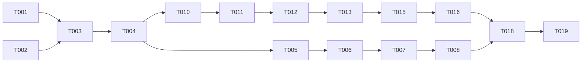
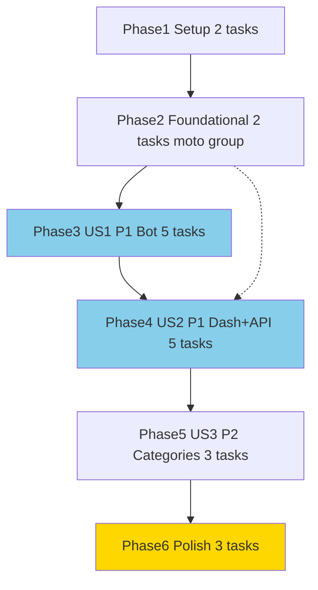

# Tasks: Cek Kategori Pertandingan

**Input**: Design documents from `/specs/007-cek-kategori-pertandingan/`
**Prerequisites**: plan.md (required), spec.md (required for user stories), research.md, data-model.md, contracts/

**Tests**: Included — every story has Feature tests (required by constitution Test-First).
**Organization**: Tasks grouped by user story (Bolts).
**Bolts**: US1, US2, US3 each is one Bolt (short, shippable). Polish is final Bolt.

## Format: `[ID] [P?] [Story] [FR-###?] Description`

## Phase 1: Setup (Shared Infrastructure)

**Purpose**: Verify branch and baseline

- [X] T001 Verify branch 007-cek-kategori-pertandingan and specs exist in `specs/007-cek-kategori-pertandingan/spec.md`
- [X] T002 Run baseline `composer test` and `./vendor/bin/pint --test` to ensure green before changes

---

## Phase 2: Foundational (Blocking Prerequisites)

**Purpose**: Cross-cutting helper for category normalization and moto group

- [X] T003 [FR-009] Add/verify `SportPrefsService::normalizeSport` handles aliases `mlbb`/`ml` → `mobilelegend` and `SportPrefsService::SPORTS` canonical list in `app/Services/SportPrefsService.php`
- [X] T004 [FR-009][FR-010] Add moto group helper `isMotoGroup()` and `normalizeCategory()` wrapper for aggregation `motogp,moto2,moto3,baggers` in `app/Services/SportPrefsService.php` or `app/Support/MatchHelper.php`

**Checkpoint**: Foundation ready — story work can begin

---

## Phase 3: User Story 1 - Cek jadwal per kategori via Bot Telegram (Priority: P1) 🎯 MVP

**Goal**: `/schedule [kategori]` single optional arg filters per sport

**Independent Test**: Follow football Arsenal + volly Indonesia, insert 2 matches +6h each. `/schedule football` → only football, `/schedule` → both, `/schedule xyz` → error list, `/schedule futsal` empty → kategori-specific empty, `OWNER_ID` guard.

### Tests for User Story 1

- [X] T005 [P] [US1][FR-001][FR-002] Create Feature test `tests/Feature/BotCategoryTest.php` covering single kategori parse, invalid kategori error, empty kategori message, unauthorized, motogp group aggregation

### Implementation for User Story 1

- [X] T006 [US1][FR-001][FR-002] Update `BotRouter::handle()` routing for `/schedule`/`/jadwal`/`/next` with optional arg and `BotRouter::MENU` + `WELCOME` in `app/Services/BotRouter.php`
- [X] T007 [US1][FR-003][FR-010] Update `BotRouter::handleJadwal(int $uid, int $cid, TelegramService $tg, ?string $category)` to filter prefs + DB `match_schedule` + per-sport fallback only for that category in `app/Services/BotRouter.php`
- [X] T008 [US1][FR-004] Implement dynamic header `📅 Schedule {kategori} — next 7 days` vs `📅 Schedule next 7 days` and cap10 sorted in `app/Services/BotRouter.php`
- [X] T009 [US1] Run `composer test --filter=BotCategoryTest` and fix `BotRouter` until green, then `./vendor/bin/pint` in `app/Services/BotRouter.php`

**Checkpoint**: US1 fully functional — bot per-kategori works, no regression for `/schedule` tanpa arg

---

## Phase 4: User Story 2 - Filter kategori di Dashboard Sports (Priority: P1)

**Goal**: Tabs kategori di `SportsPage.vue` client-side filter + API `sport_type` param

**Independent Test**: Seed 3 matches football/volly/futsal. Open `/sports`, click tab `football` → only football visible, badge counts correct, `?sport=football` deep-link auto active, no re-fetch.

### Tests for User Story 2

- [X] T010 [P] [US2][FR-005] Create API test `tests/Feature/MatchCategoryApiTest.php` for `GET /api/matches?sport_type=football` filtered, `motogp` group, invalid 400, no param returns all in `tests/Feature/MatchCategoryApiTest.php`

### Implementation for User Story 2

- [X] T011 [US2][FR-005] Add `sport_type` optional filter with `normalizeSport` + allowlist + `motogp` group `whereIn` handling in `app/Http/Controllers/Api/MatchController.php`
- [X] T012 [US2][FR-006] Add tabs filter UI (Semua + SPORTS) client-side computed `filteredMatches`, active state, `URLSearchParams` deep-link and `pushState` on change in `resources/js/views/SportsPage.vue`
- [X] T013 [US2][FR-006] Wire badge count per tab from `matches` array in `resources/js/views/SportsPage.vue`
- [X] T014 [US2] Run `composer test --filter=MatchCategoryApiTest` and manual Vue check, then `npm run build` smoke in `resources/js/views/SportsPage.vue`

**Checkpoint**: US2 done — API and dashboard filter consistent

---

## Phase 5: User Story 3 - Daftar kategori & statistik per kategori (Priority: P2)

**Goal**: `/categories` bot + dashboard badge already, but ensure full coverage

**Independent Test**: Follow 2 football +1 futsal, `/categories` → `football (2), futsal (1)`, dashboard tabs show `football (1 jadwal)`.

### Implementation for User Story 3

- [X] T015 [US3][FR-007] Implement `BotRouter::handleCategories()` counting `user_preferences` grouped by `sport_type` and route `/categories`/`/kategori`/`/category` in `app/Services/BotRouter.php`
- [X] T016 [US3][FR-007][FR-008] Add `MENU['categories']` entry and update help text `/schedule [kategori]` usage in `app/Services/BotRouter.php`
- [X] T017 [US3] Add `BotCategoryTest` cases for `/categories` count and alias in `tests/Feature/BotCategoryTest.php`

**Checkpoint**: All 3 stories functional

---

## Phase 6: Polish & Cross-Cutting Concerns

**Purpose**: Quality gate

- [X] T018 Run `./vendor/bin/pint` fix then `./vendor/bin/pint --test` across changed files
- [X] T019 Run `composer test` full suite green
- [X] T020 Run `npm run build` and `quickstart.md` manual validation for bot + dashboard + API

---

## Dependencies & Execution Order

### Phase Dependencies

- **Setup (Phase 1)**: No dependencies — start immediately
- **Foundational (Phase 2)**: Depends on Setup — BLOCKS all stories (T003-T004)
- **User Stories (Phase 3+)**: Depend on Foundational
  - US1 and US2 both P1 — can run in parallel after Foundational if staffed, otherwise US1 → US2 → US3
- **Polish (Phase 6)**: Depends on all desired stories complete

### User Story Dependencies

- **US1 (P1)**: After Foundational, no other story dependency — standalone bot
- **US2 (P1)**: After Foundational — standalone dashboard+API, [P] with US1 (different files: `MatchController.php` + `SportsPage.vue` vs `BotRouter.php`)
- **US3 (P2)**: After Foundational — depends on US1's BotRouter but additive, can start after US1 T006

### Within Each User Story

- Tests before implementation (T005 before T006, T010 before T011)
- Services/helpers before endpoints/UI

### Parallel Opportunities

- T005 [P] and T010 [P] can run in parallel (different test files)
- T006 (BotRouter) and T011 (MatchController) are different files → [P] if Foundational done — but T006 carries FR-001..004, T011 carries FR-005, so flagged [P] via Phase parallelism
- T012/T013 within US2 are same file `SportsPage.vue` → NOT [P] (sequential)
- T018 Pint and T019 tests after code: sequential

---

## Parallel Example: US1 + US2

```bash
# After Foundational (T004 done), launch tests in parallel:
Task T005: BotCategoryTest.php
Task T010: MatchCategoryApiTest.php

# Then implementations on different files can parallel:
Dev A: T006-T008 (BotRouter.php)
Dev B: T011 (MatchController.php) + T012 (SportsPage.vue)
```

---

## Implementation Strategy

### MVP First (US1 Only)

1. T001-T004 Foundational
2. T005-T009 US1 — bot per kategori
3. STOP validate `composer test --filter=BotCategoryTest` + manual `/schedule football`

### Incremental Delivery

1. Setup + Foundational → foundation ready
2. US1 → bot per kategori — MVP shippable
3. US2 → dashboard + API filter — increment
4. US3 → categories listing — increment
5. Polish — gate

### FR Coverage

| FR | Task |
|----|------|
| FR-001 single kategori | T006 |
| FR-002 validate kategori | T006, T005 |
| FR-003 filter per kategori prefs+DB | T007 |
| FR-004 cap10 header | T008 |
| FR-005 API sport_type | T011, T010 |
| FR-006 dashboard tabs | T012, T013 |
| FR-007 categories listing | T015, T017, T016 |
| FR-008 MENU update | T006, T016 |
| FR-009 normalize alias | T003, T004 |
| FR-010 per-sport isolation fallback | T007 |

All 10 FRs covered.

---

## Task Dependencies & Timeline

### Dependency Graph



### Phase Structure Diagram


